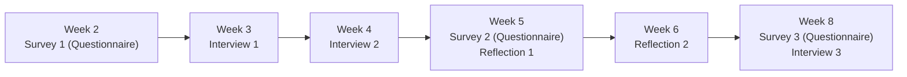

---
cssclasses:
---

```mermaid
graph LR
    W2["Week 2<br>Survey 1 (Questionnaire)"] --> W3["Week 3<br>Interview 1"]
    W3 --> W4["Week 4<br>Interview 2"]
    W4 --> W5["Week 5<br>Survey 2 (Questionnaire)<br>Reflection 1"]
    W5 --> W6["Week 6<br>Reflection 2"]
    W6 --> W8["Week 8<br>Survey 3 (Questionnaire)<br>Interview 3"]
```
