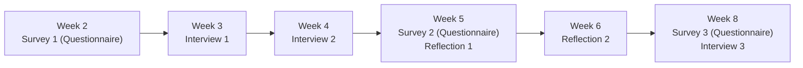
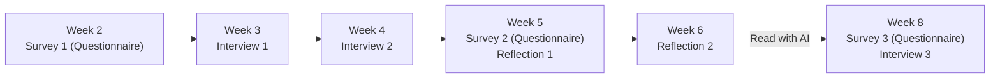
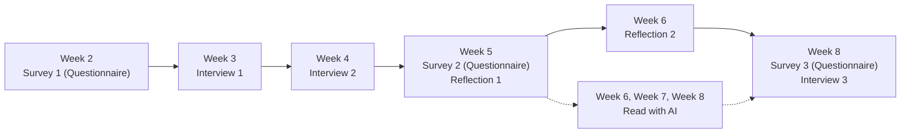
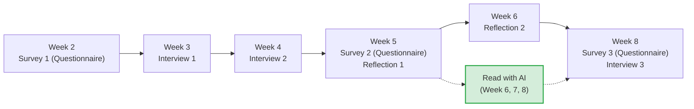
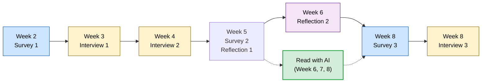
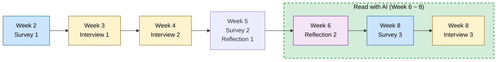
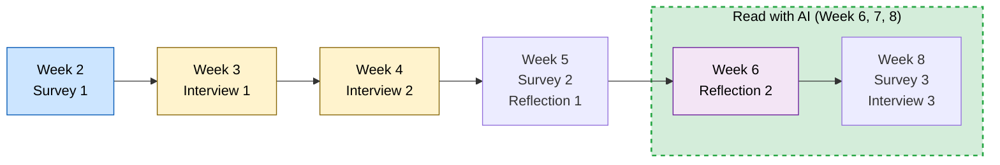
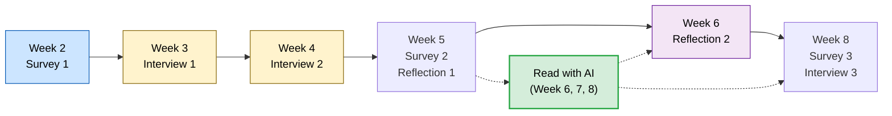
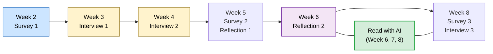

---
cssclasses:
---

```mermaid
graph LR
    W2["Week 2<br>Survey 1 (Questionnaire)"] --> W3["Week 3<br>Interview 1"]
    W3 --> W4["Week 4<br>Interview 2"]
    W4 --> W5["Week 5<br>Survey 2 (Questionnaire)<br>Reflection 1"]
    W5 --> W6["Week 6<br>Reflection 2"]
    W6 --> W8["Week 8<br>Survey 3 (Questionnaire)<br>Interview 3"]
```

```mermaid
graph LR
    W2["Week 2<br>Survey 1 (Questionnaire)"] --> W3["Week 3<br>Interview 1"]
    W3 --> W4["Week 4<br>Interview 2"]
    W4 --> W5["Week 5<br>Survey 2 (Questionnaire)<br>Reflection 1"]
    W5 --> W6["Week 6<br>Reflection 2"]
    W6 -- "Read with AI" --> W8["Week 8<br>Survey 3 (Questionnaire)<br>Interview 3"]
```

```mermaid
graph LR
    W2["Week 2<br>Survey 1 (Questionnaire)"] --> W3["Week 3<br>Interview 1"]
    W3 --> W4["Week 4<br>Interview 2"]
    W4 --> W5["Week 5<br>Survey 2 (Questionnaire)<br>Reflection 1"]
    
    %% 主流程線
    W5 --> W6["Week 6<br>Reflection 2"]
    W6 --> W8["Week 8<br>Survey 3 (Questionnaire)<br>Interview 3"]
    
    %% AI介入分支線 (Week 6 - Week 8)
    W5 -.-> AI["Week 6, Week 7, Week 8<br>Read with AI"]
    AI -.-> W8
```

```mermaid
graph LR
    W2["Week 2<br>Survey 1 (Questionnaire)"] --> W3["Week 3<br>Interview 1"]
    W3 --> W4["Week 4<br>Interview 2"]
    W4 --> W5["Week 5<br>Survey 2 (Questionnaire)<br>Reflection 1"]
    
    %% 主時間軸（資料收集）
    W5 --> W6["Week 6<br>Reflection 2"]
    W6 --> W8["Week 8<br>Survey 3 (Questionnaire)<br>Interview 3"]
    
    %% 新增的 Read with AI 分支線
    W5 -.-> AI["Read with AI<br>(Week 6, 7, 8)"]
    AI -.-> W8
    
    %% 幫 AI 節點上個顏色讓它更明顯 (選用)
    style AI fill:#d4edda,stroke:#28a745,stroke-width:2px
```

```mermaid
graph LR
    %% 定義不同活動的顏色與樣式類別
    classDef survey fill:#cce5ff,stroke:#0056b3,stroke-width:1px,color:#000
    classDef interview fill:#fff3cd,stroke:#856404,stroke-width:1px,color:#000
    classDef reflection fill:#f3e5f5,stroke:#6a1b9a,stroke-width:1px,color:#000
    classDef ai fill:#d4edda,stroke:#28a745,stroke-width:2px,color:#000

    %% 定義節點與套用樣式
    W2["Week 2<br>Survey 1"]:::survey
    W3["Week 3<br>Interview 1"]:::interview
    W4["Week 4<br>Interview 2"]:::interview
    
    %% Week 5 保持預設顏色
    W5["Week 5<br>Survey 2<br>Reflection 1"]
    
    W6["Week 6<br>Reflection 2"]:::reflection
    
    %% 將 Week 8 拆分為兩個節點以分別上色
    W8_S["Week 8<br>Survey 3"]:::survey
    W8_I["Week 8<br>Interview 3"]:::interview
    
    %% Read with AI 節點
    AI["Read with AI<br>(Week 6, 7, 8)"]:::ai

    %% 建立流程連線
    W2 --> W3
    W3 --> W4
    W4 --> W5
    
    %% 主流程線
    W5 --> W6
    W6 --> W8_S
    W8_S --> W8_I
    
    %% Read with AI 的分支線
    W5 -.-> AI
    AI -.-> W8_S
```

```mermaid
graph LR
    %% 定義不同活動的顏色與樣式類別
    classDef survey fill:#cce5ff,stroke:#0056b3,stroke-width:1px,color:#000
    classDef interview fill:#fff3cd,stroke:#856404,stroke-width:1px,color:#000
    classDef reflection fill:#f3e5f5,stroke:#6a1b9a,stroke-width:1px,color:#000

    %% 前期流程
    W2["Week 2<br>Survey 1"]:::survey --> W3["Week 3<br>Interview 1"]:::interview
    W3 --> W4["Week 4<br>Interview 2"]:::interview
    W4 --> W5["Week 5<br>Survey 2<br>Reflection 1"]

    %% 進入 AI 介入階段
    W5 --> W6

    %% 使用 subgraph 來 "涵蓋" 第 6 到 8 週
    subgraph AI_Phase ["Read with AI (Week 6 ~ 8)"]
        direction LR
        W6["Week 6<br>Reflection 2"]:::reflection
        W8_S["Week 8<br>Survey 3"]:::survey
        W8_I["Week 8<br>Interview 3"]:::interview
        
        W6 --> W8_S
        W8_S --> W8_I
    end

    %% 設定 subgraph (涵蓋範圍外框) 的顏色樣式
    style AI_Phase fill:#d4edda,stroke:#28a745,stroke-width:2px,color:#000,stroke-dasharray: 5 5
```

```mermaid
graph LR
    %% 定義不同活動的顏色與樣式類別
    classDef survey fill:#cce5ff,stroke:#0056b3,stroke-width:1px,color:#000
    classDef interview fill:#fff3cd,stroke:#856404,stroke-width:1px,color:#000
    classDef reflection fill:#f3e5f5,stroke:#6a1b9a,stroke-width:1px,color:#000

    %% 前期流程
    W2["Week 2<br>Survey 1"]:::survey --> W3["Week 3<br>Interview 1"]:::interview
    W3 --> W4["Week 4<br>Interview 2"]:::interview
    W4 --> W5["Week 5<br>Survey 2<br>Reflection 1"]

    %% 進入 AI 介入階段
    W5 --> W6

    %% 使用 subgraph 來 "涵蓋" 第 6 到 8 週
    subgraph AI_Phase ["Read with AI (Week 6, 7, 8)"]
        direction LR
        W6["Week 6<br>Reflection 2"]:::reflection
        
        %% 將 Week 8 合併為單一節點，且不指定特定顏色
        W8["Week 8<br>Survey 3<br>Interview 3"]
        
        W6 --> W8
    end

    %% 設定 subgraph (涵蓋範圍外框) 的顏色樣式
    style AI_Phase fill:#d4edda,stroke:#28a745,stroke-width:2px,color:#000,stroke-dasharray: 5 5
```

```mermaid
graph LR
    %% 定義不同活動的顏色與樣式類別
    classDef survey fill:#cce5ff,stroke:#0056b3,stroke-width:1px,color:#000
    classDef interview fill:#fff3cd,stroke:#856404,stroke-width:1px,color:#000
    classDef reflection fill:#f3e5f5,stroke:#6a1b9a,stroke-width:1px,color:#000
    classDef ai fill:#d4edda,stroke:#28a745,stroke-width:2px,color:#000

    %% 前期流程
    W2["Week 2<br>Survey 1"]:::survey --> W3["Week 3<br>Interview 1"]:::interview
    W3 --> W4["Week 4<br>Interview 2"]:::interview
    W4 --> W5["Week 5<br>Survey 2<br>Reflection 1"]

    %% 主線路徑 (測量與資料收集)
    W5 --> W6["Week 6<br>Reflection 2"]:::reflection
    W6 --> W8["Week 8<br>Survey 3<br>Interview 3"]

    %% 獨立的 Read with AI 節點
    %% 從 W5 延伸出來以確保它落在正確的時間區段，並連結到 W6 與 W8
    W5 -.-> AI["Read with AI<br>(Week 6, 7, 8)"]:::ai
    AI -.-> W6
    AI -.-> W8
```

```mermaid
graph LR
    %% 定義不同活動的顏色與樣式類別
    classDef survey fill:#cce5ff,stroke:#0056b3,stroke-width:1px,color:#000
    classDef interview fill:#fff3cd,stroke:#856404,stroke-width:1px,color:#000
    classDef reflection fill:#f3e5f5,stroke:#6a1b9a,stroke-width:1px,color:#000
    classDef ai fill:#d4edda,stroke:#28a745,stroke-width:2px,color:#000

    %% 定義節點與套用樣式
    W2["Week 2<br>Survey 1"]:::survey
    W3["Week 3<br>Interview 1"]:::interview
    W4["Week 4<br>Interview 2"]:::interview
    W5["Week 5<br>Survey 2<br>Reflection 1"]
    W6["Week 6<br>Reflection 2"]:::reflection
    W8["Week 8<br>Survey 3<br>Interview 3"]
    AI["Read with AI<br>(Week 6, 7, 8)"]:::ai

    %% 主流程線 (帶箭頭)
    W2 --> W3
    W3 --> W4
    W4 --> W5
    W5 --> W6
    W6 --> W8

    %% Read with AI 獨立節點，與 Week 6 和 Week 8 建立無箭頭連結
    W6 --- AI
    AI --- W8
```
