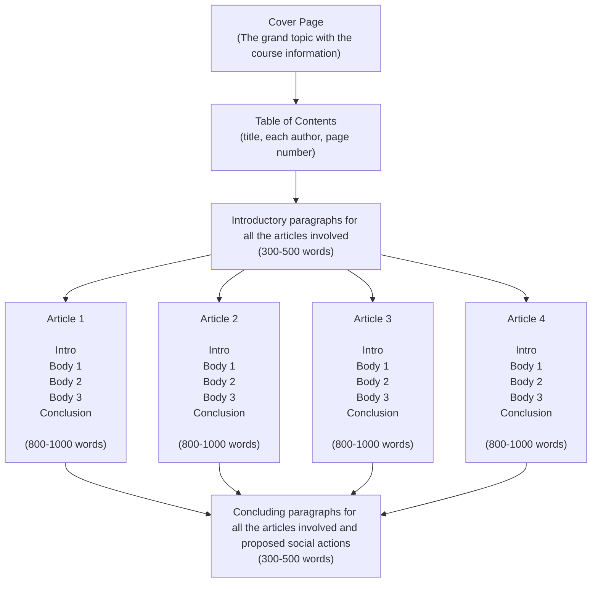

---
cssclasses:
  - center-titles
tags:
  - reading
aliases:
relevance: "[[Literacy 識能]]"
relevance 2: "[[AIL in CL.excalidraw]]"
disambiguation:
banner:
media:
prompt: literal translation, Eng to traditional chinese, one boldfaced title is seen as one paragraph, translate by paragraph per response.
version_mode: Gemini 3.1 Pro
---
Date: 2026-04-23
File Creation Date: 2026-04-21 14:43
Last Modified: 2026-04-23 13:22
File folder: Literacy, literacies, multiliteracies

![[AIL in CL.excalidraw]]

# 摘要

鑑於人工智慧 (AI) 的普及，以及隨之而來的批判識能教育教學轉變，探討學生如何在批判識能課堂中培養人工智慧識能十分重要 。現有文獻強調 AI 回饋對於識能發展的強化作用，並賦予學生批判性評估 AI 效能與侷限的能力 。然而，將 AI 與批判識能結合以應用於真實世界行動的實證研究尚稱匱乏 。因此，本研究調查學生如何採納、修改或拒絕 AI 回饋，並評估其情境對齊性與有用性，藉此檢驗他們對於 AI 能力與侷限的理解 。本研究聚焦於兩個小組中的四名學生 。在課程中，學生遵循 Lewison 等人 (2002) 的批判識能框架撰寫社會行動專案，並使用結構化的提示工程與 AI 協作撰寫文章 。本研究收集學生的寫作草稿、最終專案、與 AI 的對話紀錄、反思日誌以及半結構化事後訪談，以檢視他們處理 AI 回饋的過程以及對其能力與侷限的感知 。這些材料將透過經濟合作暨發展組織 (OECD) 的 AI 識能框架進行分析，以瞭解學生如何評估提示詞的有效性與 AI 回饋，進而推進其社會行動 。透過觀察其對 AI 回饋的決策，本研究旨在檢視學生在與 AI 參與、創作、管理與設計過程中的思考，以為未來批判識能課堂中的 AI 應用提供進一步啟示 。

**關鍵字：** 人工智慧 (AI)、人工智慧識能、英語作為外語寫作、批判識能、回饋、提示工程 

---

# 緒論

## 研究背景

我們發明的每一項新技術，從語言、書籍到電腦，都定義、重新定義、深化並擴展了身為人類的意義（Hoffman & Beato, 2025）。隨著科技進步，研究人員廣泛調查了人工智慧 (AI) 在教學與學習領域的有效性與有用性，特別是在英語作為外語 (EFL) 課堂中的學術寫作。如今，教育工作者已探索了 AI 帶來的多個維度的教學影響，包括但不限於：學生對使用 AI 寫作的看法（Alzubi et al., 2025; Fathi & Rahimi, 2026）、受 AI 槓桿調節的寫作表現（Liu et al., 2024; Luo et al., 2025; Song & Song, 2023; Wei et al., 2023）、參與度（Hu et al., 2025; Yan & Zhang, 2024），以及 AI 提供即時、調適型且個性化寫作回饋的影響（Asadi et al., 2025; Bai & Wei, 2024; Guo et al., 2024; Han & Li, 2024; Li et al., 2024; Nguyen & Barrot, 2024; Wang, 2024）。根據 Huang 等人 (2023) 的觀點，在語言學習情境中，AI 通常展現出三個特徵。首先，它們擅長生成與擴展構思，作為廣泛語言知識的儲存庫，這對應到與學生進行腦力激盪的能力。其次，AI 能夠針對學生的詢問提供調適型回饋，為其在課外環境的參考提供額外見解。第三，由於 AI 在道德規範下透過自然語言處理 (NLP) 直接與使用者進行話語交流，它們具備了基本的社交功能，這對於為學生創造一個互動平面至關重要，並揭示了 Freire (1970) 對話式教學法的輪廓，該教學法強調意義的共同建構與平等對話，其中主動交織了多種觀點。整體而言，其基於數據集在線檢索信息以提供個性化、即時且調適型回饋的能力，以及在語法、結構和字詞選擇上的語言指導，有助於增強學生的學習效率。然而，若部署不當或缺乏教育者的指導，可能會出現一些擔憂，阻礙學生學習過程的有效性，例如幻覺（Kalai et al., 2025; Salvagno et al., 2023; Sun et al., 2024; Zhang et al., 2025）、錯誤訊息（Monteith et al., 2024）、諂媚性（Naddaf, 2025; Sharma et al., 2023）、詞彙過度代表性（Juzek & Ward, 2025）、偏見（Farlow et al., 2024）、不對齊（Ji et al., 2023）、過度依賴、對其反應（無論是事實還是幻覺）盲從，並最終導致認知能力的降低（Kosmyna et al., 2025; Lee et al., 2025）。換句話說，這些缺點揭示了教學上的啟示，並提出了在 21 世紀隨著 AI 等迭代技術出現而進行識能教育的需求。儘管 AI 是語言教育的雙面刃，但如果能在結構化提示詞和識別回饋能力方面得到良好的指導與搭建鷹架，AI 仍能顯著提升學生的能力（Lin & Hwang, 2025）。教育工作者已經評估了 AI 對學生認知發展帶來的益處，例如批判性思考（Chen et al., 2024）、後設認知、閱讀與寫作表現、創造力以及問題解決能力。另一方面，AI 也越來越多地被提議用於增強學生的識能（Kalantzis & Cope, 2025），例如數位識能（Darvin, 2025 b; Zhang & Zhang, 2024）、媒體識能（Stewart & Rodgers, 2025）、資訊識能（Tiernan et al., 2023）、回饋識能（Rad et al., 2024; Zhan & Yan, 2025），以及最後但同樣重要的人工智慧 (AI) 識能（Kong et al., 2025; Ng et al., 2024）。

## 問題陳述

由經濟合作暨發展組織（OECD）定義的人工智慧（AI）識能，代表了學生參與、共同創造、管理及設計 AI 的能力，同時能批判性地評估其效益、風險與倫理影響 。因此，學生可以做出安全且知情的決策 。具體而言，OECD 的 AI 識能框架包含四個範疇，代表學生與 AI 互動的不同方式，包括：參與 AI、與 AI 共創、管理 AI 以及設計 AI 。這四個範疇為本研究的情境奠定了堅實基礎，闡明了學生將如何向 AI 學習、與 AI 一同學習，甚至超越 AI 進行學習 。

儘管教育者和實務工作者已闡述了 AI 能為能力與素養帶來的諸多益處，但目前仍不夠全面，特別是在與 AI 協作時，側重於對現實世界社會政治議題產生影響的批判識能（Critical Literacy）方面 。源於保羅·弗萊雷（Paulo Freire）的批判教育學，批判識能旨在賦權學生解構壓迫者與被壓迫者的二元關係，透過「閱讀文字」進而「閱讀世界」，來命名、重新命名、重新敘述並理解學生的生活世界 。延續「重新敘述」的脈絡，此處的寫作可被理解為一種實現閱讀理解，以及進一步轉化現實世界議題以追求社會正義之策略的手段 。Luke (2013) 進一步擴展了「批判識能」的定義，將其定義為「利用印刷及其他通訊媒體的技術，來分析、批判和轉化支配日常生活社會領域的規範、規則系統和實踐」 。Luke 的陳述凸顯了 AI 在現代批判識能教育中的適用性，且直到 2026 年，批判識能經常在人工智慧教育（AIEd）的情境中被理論性地提及 。

然而，很少有研究針對批判識能方面的 AI 現實世界實踐進行實證調查 。在 Kurniati 等人 (2025) 的著作中，批判識能被視為一種文化嵌入的導向，這與同理心和互聯網認識論信念有關，並能在與 AI 協作寫作的過程中促進反思與倫理實踐，從而引發涵蓋社會文化情境中認知情感發展的「感同身受型 AI 識能」之形成 。此外，研究結果顯示，學生經常對 AI 生成或檢索的信息尋求確認，以防止自己因 AI 幻覺而在寫作中陷入非批判性的立場 。然而，這種概念化將批判性參與的範圍侷限在信息驗證和個人心理安慰上 。這種做法雖然支持了學生的認知和心理發展，卻掩蓋了對 AI 輸出具有情感挑戰性但批判深刻的觀點 。Kurniati 等人 (2025) 所定義的批判性源於透過事實查核、三角測量和反思性閱讀對數位實體的信念，但這不足以確保學生不受來自 AI 潛在諂媚性反應的影響，也不足以體現弗萊雷批判識能的本質——即旨在透過多元視角審視現實的社會政治本質，並延伸對話，將 AI 視為一個支持性實體，但同時也是受批判的對象 。總之，Kurniati 等人 (2025) 對批判識能的定義儘管對學生有益，但在某種程度上偏向認知且沉重依賴情感維度，較不像是弗萊雷式的批判識能 。

另一方面，Thongsan 與 Anderson (2025) 的著作利用由 OpenAI 開發的對話模型 ChatGPT，來搭設學生在批判性閱讀中高階思維的鷹架 。具體而言，學生與 AI 協作閱讀，以評估文本中的論證和偏見，並最終挑戰 AI 的解釋、替代視角以及 AI 回應中的客觀性 。此外，這項實證研究暗示，此類概念基礎凸顯了 AI 在促進 EFL 教育中批判識能和負責任使用技術方面的適用性，為本研究建立了一個強而有力的論據 。儘管如此，Thongsan 與 Anderson (2025) 對批判識能的概念化仍侷限於高階認知技能以及對 AI 輸出的批判性評估，這與側重事實信息的批判性思考，或是強調對 AI 輸出進行倫理檢查的 AI 識能較為接近，而非批判識能 。

關於 AI 的機制，承認 AI 由於持續的訓練、學習與迭代而具有客觀本質是合理的 。同時，培養學生識別主旨、評估來自原作者與 AI 的論點以及識別偏見的能力至關重要 。然而，同樣地，此類認知能力很難被視為能以多種觀點看待特定文本的批判識能 。換句話說，儘管 AI 模仿了某些角色或人物的視角，但這些視角主張基本上是其作為「隨機鸚鵡」（stochastic parrot）本質下的產物，也就是說，這些主張是建立在從海量數據集和在線信息中進行精確選擇的基礎上，而缺乏真正的理解 。因此，AI 表面上的主觀視角是從客觀信息中模擬出來的，從這個意義上說，學生難以識別由現實生活情境中多元視角交織而成的現實 。結果，在真實情境中的現實世界經驗與理解變成了必要條件，以此邀請 AI 加入關於寫作的對話，進行一場超越事實與客觀性的實際練習 。

## 研究目的

為了彌補上述研究缺口，本研究旨在探索學生如何採納或拒絕來自 AI 的回饋，以及他們將如何進一步批判性地評估其情境理解的程度與有用性 。藉此，本研究試圖賦權學生在針對社會行動的學學術寫作專案中，與 AI 進行對話、共創並對其提出批判 。

## 研究問題

在本研究中，研究問題列舉如下：
- 學生在批判識能寫作專案中，以何種方式採納、修改或拒絕由 AI 生成的回饋？
- 學生對於批判識能寫作中的提示詞設計、AI 的情境對齊及其有用性有何看法？
---
# 文獻探討
## 以識能與人工智慧進行寫作

語言是我們所有人深入瞭解的媒介，而資訊的媒介則是書面形式的語言：識能（Kress, 2005） 。識能若遵循其基本但不完整的定義，即是閱讀與寫作的能力（Kendeou et al., 2023），然而這缺乏進一步的擴展詮釋 。在概念或理論意義上，閱讀字詞是向學生具體化「閱讀世界」範圍的手段，同時，寫作被代表為創造新知識的媒介，以及挑戰時空的虛擬遠距傳輸管道 。在實踐上，識能是指使用書面語言表達自我與溝通的能力（Long & Magerko, 2020） 。作為識能的載體，文本遍佈於日常物品中，且文本可以透過多種觀點的交織來被閱讀、設計與產出，結合我們所使用的語言，進而承認寫作是 EFL 學生產出技巧成長中的關鍵面向（Haiyan & Rilong, 2016; Lewison et al., 2002; Vasquez et al., 2019） 。除了這項迷人的屬性外，資訊與通訊科技 (ICTs) 的進步伴隨著媒介的轉型，協助了以識能進行表達與敘事的方式 。當識能即是生活，具有生成性與再生性以貢獻評論與抗辯時 (Morrell, 2003)，「生成」一詞似乎讓我們重新思考在人工智慧 (AI) 時代其意義與組成 。AI 這種複雜且難以解釋的數位存在，被訓練來根據使用者的書面提示（即需求）預測或生成新的、機率性產出的數據（即內容），以進一步實現渴望的可能性（Banh & Strobel, 2023; Burriss & Leander, 2024） 。此外，隨著 AI 普遍應用於日常生活，在某種程度上，自動寫作評估 (AWE) 工具（如 Quillbot 和 Grammarly）以及智慧教學系統 (ITS)（如 Duolingo），在大型語言模型 (LLMs)（如 ChatGPT 和 Gemini）出現之前就已參與了語言教育 。鑑於此，作為一種顛覆性技術，AI 有能力以史無前例的方式徹底改變語言與識能實踐（Darvin, 2025 a） 。

## AI 在教育中的益處與隱憂

教育工作者已評估了 AI 在學生認知發展方面的益處，例如批判性思考（Chen et al., 2024; Shen & Chen, 2025; Yin & Dou, 2025）、閱讀與寫作表現、創造力以及問題解決能力 。另一方面，AI 也日益被提議用於增強學生的識能（Kalantzis & Cope, 2025），如數位識能（Darvin, 2025 b; Zhang & Zhang, 2024）、媒體識能（Stewart & Rodgers, 2025）、資訊識能（Tiernan et al., 2023）、回饋識能（Rad et al., 2024; Zhan & Yan, 2025）、提示識能（Knoth et al., 2024）以及最後的人工智慧識能（Kong et al., 2025; Ng et al., 2024）。在識能研究中，研究者與教育者對 AI 在寫作教育中的應用做出了顯著貢獻 。在實證方面，Song 與 Song (2023) 採用混合研究法檢視了 50 名 EFL 學生在 ChatGPT 輔助寫作教學背景下的寫作技能與動機 。結果顯示，AI 能顯著促進 EFL 學生在組織、連貫性、語法和詞彙方面的寫作動機與技能 。然而，透過半結構化訪談，學生提到了對其情境準確性和過度依賴問題的擔憂 。Woo 等人 (2024) 也進行了一項涉及 21 名 EFL 學生的混合研究，調查在使用 ChatGPT 寫作後的學習動機、認知負荷與滿意度 。研究結果揭示，這些學生表現出高滿意度，但學習動機中等且認知負荷較高，這可歸因於與 AI 互動寫作的時間有限，以及提示工程技能培訓過於倉促 。此啟示對應了 Morrell (2003) 的陳述，建議若無充足的寫作時間，學生最終只會得到精彩但不完整的想法，並失去將優秀素材發展成優秀寫作的機會 。換言之，該研究隱含著寫作者應接受充足的提示詞撰寫訓練，以賦予 AI 與寫作者有效腦力激盪的能力，進而減少時間與負荷 。另一方面，Niloy 等人 (2024) 評估了 600 名學生使用 ChatGPT 進行創意寫作的任務 。結果顯示創造力、準確性與原創性顯著下降，且對過度依賴阻礙批判性思考與寫作風格同質化的擔憂，成為教育者謹慎整合 AI 並採取深思熟慮搭建鷹架策略的警訊 。儘管如此，透過結構化與特定的干預，AI 反過來能促進學生的表現與思考技能 。在 Yin 與 Dou (2025) 的研究中，他們利用批判性思考導向的框架，將 AI 作為智力夥伴協助 250 名 EFL 大學生的寫作測試 。結果顯示，AI 能有效引導學生識別草稿的目的、關鍵問題與多重觀點，學生的寫作表現與批判性思考在邏輯維度上展現出巨大增長，證明了搭建鷹架與干預對整合 AI 的重要性 。顯然，眾多研究提出了 AI 在教育環境中的優點與缺點，而其機制可能導致需要教育者與使用者（如學生）去識別的問題 。麻省理工學院 (MIT) 的 Kosmyna 等人 (2025) 使用腦電圖 (EEG) 評估寫作過程中的思考 。EEG 結果顯示，AI 依賴組的寫作與思考表現最低，因為 AI 完全承擔了認知負擔與需要記憶的信息，從而使寫作者的大腦活動脫節 。必須指出的是，這種脫節源於完全外包給 AI，這與許多研究中提到的過度依賴相似 。在 Shroff (2025) 發表於《大西洋月刊》的一篇文章中，創造了「LLeMmings」一詞來描述這種依賴 AI 的個體，他們的決策和思維都先經過 AI 過濾，從而表現得像旅鼠一樣，傾向於陷入集體無意識行為而缺乏獨立思考 。Hoffman 與 Beato (2025) 指出，LLMs (AI) 從不以人類的方式理解事實或概念 。相反地，每當向其提問或要求行動時，只是要求它以情境相關的方式對後續標記進行機率預測 。然而，某些行為與人類特質或謬論相似 。Kalai 等人 (2025) 提出了「幻覺」現象，即 AI 可能產生過度自信且看似合理的虛假陳述，從而降低其效用與信任度 。此外，還存在「諂媚性」問題 。如 Sharma 等人 (2023) 所述，人類回饋是訓練 AI 偏好模型的主要來源，為了立即獲得獎勵，AI 可能會優先匹配使用者信念而非真實性，甚至確認使用者的錯誤觀念 。Walter (2024) 也指出其他問題，如 AI 對齊（回答超出請求）、AI 失控（行為超出要求）、AI 歧視（基於偏差數據產生偏見）以及 AI 鎖定（陷入特定情境而失去焦點）。這些現象和上述研究闡明了學生批判性地評估人工智慧的回應和回饋的重要性，從而提高了語言學習的有效性，尤其是在寫作方面。儘管人工智慧是語言教育的雙面刃，但如果能在結構化提示詞與識別回饋的能力方面獲得良好的指導與鷹架搭建，AI 仍能顯著提升學生的能力（Lin & Hwang, 2025）。因此，目前應準備讓學生具備檢查事實真實性與可靠性的能力 。在這些研究中，可以歸納出兩個主要主題，用以概括性地（儘管尚不完整）綜合 AI 支持 EFL 寫作教育的現況 。第一，學生與 AI 雙方都應配備一種或數種鷹架策略，以建構知識並進而促進能力發展 。第二，AI 能夠透過統計模型數據集、教育者的干預請求或學生的提示技能等多元視角，生成訂正、形式或評估回饋，且學生應學習如何與 AI 參與、創作、管理與設計，以達成學習目標 。

## 提示與定位回饋

除了搭建鷹架與直接指導外，回饋在語言學習過程中也具有重要作用，因為它是學生理解與表現相關的資訊以促進其學習的過程（Henderson et al., 2019）。由於課堂中的知識各不相同，目前回饋的來源可以是教師、助教、同儕，以及模仿人類智力過程並模擬人類對話的 AI（Asadi et al., 2025）。與需要時間和費力審查學生書面作品的人類回饋不同，AI 檢索現有資訊，並利用其快速的計算與處理能力，在幾秒鐘內呈現類似人類寫作的文本，從而產生即時、易於取得且個人化的回饋，而無需受限於時空因素的前提。儘管如此，由於其龐大但不可控的檢索過程，如果沒有人類的監控與微調，它有時無法使回應與現實世界的情境或要求對齊。因此，面對不穩定的輸出，通常可以分為兩個程序：結合現有的支持，或者重要的是在課堂或學生的識能中結合現有的支持，以評估對回饋的吸收。在 Asadi 等人 (2025) 的研究中，他們採用了一種綜合的方法來結合教師與 AI 的指導，研究發現，相較於僅接受教師回饋指導的學生，EFL 學生在這種綜合指導下的雅思寫作任務二中表現異常優異。在訪談中，教師提到 AI 具備個人化與回應性的特徵、即時性，以及對特定要求的調適能力。然而，也報告了一些限制，例如過度依賴、難以保證精確性、未能考量重要的情境意涵，從而留下了確定 AI 寫作回饋的合適應用與限制的需求。至於教師與 AI 回饋的比較，Lin 與 Crosthwaite (2024) 分別評估了教師與 AI 在第二語言 (L2) 寫作中回饋的焦點。研究結果報告指出，教師能夠將焦點放在結構、語法、內容與組織上，儘管會有些微的不準確。同時，AI 的焦點在於錯誤解釋與文本的重新建構，這可以幫助學生理解建議修改的原因，但它在語法和字詞選擇上表現出冗餘與短視。另一方面，Han 與 Li (2024) 選擇了一種互補的方法，即教師向學生提供他們根據 AI 輸出進行調適後的精煉回饋。調查結果顯示，這種結合減少了工作量，從而使教師能夠在大班教學環境中提供詳細的評論。此外，學生反映出相當高的參與度，並認可其在解決全球問題方面對他們寫作的特異性，這意味著人類的監督對於確保輸出的相關性與特異性是必要的。另一方面，從學生與 AI 在回饋過程中互動的角度來看，Zhan 與 Yan (2025) 調查了在雅思寫作中對 AI 回饋的參與程度。他們揭示學生傾向於比較文本、提取關鍵資訊，或選擇性地將焦點放在 AI 生成的回饋上，以如預期般進一步修改並改善他們的寫作。然而，研究人員也指出，大多數學生僅選擇進行一次性的對話、直接提示要求修改，以及旨在立即表現的短期目標，而不是自行發展寫作技能。為了回應 Zhan 與 Yan (2025) 對學生一次性對話的擔憂，以及 Walter (2024) 所提到的 AI 回饋與基於策略性製作輸入以引出 AI 預期回應的提示工程可能帶來的學習阻礙，Google Workplace (2024) 提出了一份涵蓋工作流程與學習效率普遍需求的提示指南。在其提示指南中，有一個名為 PTCF 的框架，包括角色 (persona)、任務 (task)、情境 (context) 與格式 (format)，這可以成為建立後續互動所需輸出的有效起點。首先，角色是指 Walter (2024) 所述的專家提示，它使 AI 能夠承擔特定知識領域專家的角色，從而產生更具體且較不模糊的回應。其次，任務是指自我一致性提示，學生刻意將推理分解為多個步驟，以確保 AI 能夠遵循這種模式，從而減輕產生幻覺的可能性。第三，情境是指思維樹提示，它可以回溯和推進想法，然後透過多種觀點與條件來模擬情境以提供最佳選項，這有助於學生透過幾個可能的視角理解情境，並進而培養批判識能的意識。最後，格式可以幫助 AI 根據使用者的期望產生結構化的輸出，例如項目符號、表格或 Markdown 格式。透過這種方式，學生可以清楚地以他們渴望的格式吸收資訊，並檢查哪個面向應該被進一步發展、澄清或更正。

## AI 回饋及其有用性

遠在 1980 年代專家系統（現今 AI 的前身）普及之前的完全人類回饋時代，Kulhavy (1977) 對學習與回饋的觀點，正處於以印刷材料作為主要教學媒介與電腦輔助教育初期發展的交會點 。在他的研究中，Kulhavy (1977) 總結指出，回饋不必然是一種增強物，因為當學生需要在內容或邏輯推理上進行修正時，它的效果最好 。這項發現挑戰了史金納行為主義武斷聲稱回饋具有絕對益處的觀點，並暗示回饋的有效性取決於學生的實際狀況與需求 。在 Hattie 與 Timperly (2007) 闡述回饋教學影響的研究中，他們繼承了 Kulhavy (1977) 對回饋的觀點，並進一步主張回饋應該是學生可以決定採納、修改或拒絕的資訊 。此外，Hattie 與 Timperly (2007) 指出，回饋是建立在一個熟悉且相對可理解的學習過程基礎之上 。循此脈絡，我們可以將這個前提指向包含提示詞以及發送給 AI 的任何形式輸入的書面文本，而這個層面的資訊也反映了學生對於他們已經知曉並渴望進一步探索的情境的實際理解 。

至於「拒絕」一詞，儘管被 Hattie 與 Timperly (2007) 提及為回饋的選項之一，但在 AI 出現之前，它在學術研究中鮮少受到關注 。數十年來，回饋主要來自處於相同課堂或相似情境的教育者與同儕 。因此，回饋被認為對修正與確認都是有幫助或互補的 。此外，遵循 Kulhavy (1977) 關於回饋在修正上有用性的觀點，基於修正語法與字詞選擇的自動寫作評估 (AWE) 工具，如 Grammarly 與 Quillbot，也被認為是有用的 。然而，當涉及 AI 回饋時，這些肯定的條件可能並不總是成立 。Chen 等人 (2026) 進行了一項實證研究，透過被稱為科技接受與使用統一理論 (UTAUT) 的框架，調查了 AI 輔助學術寫作中 AI 回饋的採納率 。調查結果確認有將近一半 (45.9%) 的 AI 回饋被拒絕，主要是由於與他們的期望不符以及輸出過於籠統 。然而，該研究並沒有針對「期望」一詞擴展對話，而是留下了一個簡短的解釋，即在這種前提下，AI 無法幫助他們改善作品或表現，因為它可能無法完全理解他們寫作中的微妙之處，而「微妙之處」一詞暗示了學生感知到的有用性 。總結來說，本研究主張，現今學生在面對 AI 回饋時，應該具備評估 AI 的輸出是否正是他們想知道的內容的能力，並對是否採納 AI 回饋做出決定 。

相反地，史金納回饋的增強效應似乎在兩個極端上增強了學習條件 。在一個極端，假設學生缺乏情境熟悉度與明確的期望，他們可能會屈服於過度高估與過度依賴 。此外，在這種情況下的學生可能缺乏提示技能，無法精確陳述需求與情況以使 AI 產生預期的結果 。因此，如果沒有仔細的監督，AI 驅動的決策制定可能會放大偏見並造成傷害，從而加劇對學習過程的阻礙並破壞結果 。在另一個極端，如果學生配備了適當的 AI 互動策略，他們可能會如預期般收到回饋，並擴展他們並非多餘而是必要的理解，因為他們領會了透過採納、修改或拒絕的技巧，在冗長的回應中擷取預期資訊的意義 。

除了 Chen 等人 (2026) 檢視拒絕 AI 回饋理由的實證研究外，在 Willems 等人 (2025) 的實證研究中，儘管其情境與語言教育無關，作者們揭示了一項關鍵發現，互補地填補了將拒絕作為使用 AI 學習選項的空白 。該情境發生在一門名為設計思考與創新 (DTI) 的課程中，對象為 500 名主修工程與建築的大學生，根據學生如何使用 AI、如何看待 AI、何時採納 AI 以及何時不採納 AI 的情況，學生的反思被標記為三個不同的集合 。具體而言，在這些學生的認知中，AI 的角色被分類為三個集合：AI 作為工具（提升任務效率）、AI 作為隊友（與學生共同設計），以及 AI「兩者皆非」（出於特定原因蓄意拒絕 AI）。研究結果，尤其是最後一點，驚人地顯示「兩者皆非」並不是絕對拒絕 AI 的價值，而是一個具有情境意識與倫理考量的定位決策，從而揭示了刻意不使用代表了識能的一個面向（Dang & Liu, 2024; Qin et al., 2025）；在這種情況下，拒絕應被視為一種理性的決策制定，暗示學生正在運用他們的認知與判斷力，來批判性評估他們渴望知道的事物，以及哪些資訊或內容在情境上對自己進一步發展書面文本與批判觀點是有幫助的 。根據這些關於 AI 回饋與有用性的闡述，在此應引入並強調一項關鍵識能，即 AI 識能 。

## 突顯對人工智慧識能的需求

鑑於前述研究的啟示以及教育部 (MOE) 因應 AI 帶來的教育挑戰所發出的呼籲，據說賦予學生運用批判性思考、創造力、問題解決技能以及表達需求的能力，從而在現實生活中實現想法，對於素養導向的 AI 教育是不可或缺的。因此，鞏固 AI 識能的構成是必要的。在普及的 AI 驅動技術出現之前，當 1970 年代電腦應用跨產業普及時，「數位識能」一詞被用來評估與電腦相關的基本概念與技能 (Ng et al., 2021)。儘管它提到了可以作為 AI 載體的電腦，但它未能滿足對 AI 應用的具體強調。為了邀請重視 AI 使用的教育工作者與個人探索其教學潛力，本研究採用「AI 識能」一詞來概念化 AI 教育 (AIEd) 情境中的學習過程。早在 Kandlhofer 等人 (2016) 創造此詞時（當年常見的 LLM 尚未公開發布且未在常識中被廣泛稱為 AI），AI 識能被描述為讓人們理解 AI 產品與服務背後的技術與概念的能力，而不僅僅是學習如何使用某些技術或當前應用。為了更具體地引導教育工作者逐步發展 AI 識能，他們將其定義為：(a) 建立意識並以遊戲的方式探索 AI 主題；(b) 實驗並熟悉特定 AI 主題背後的理論，且獨立致力於解決問題；(c) 培養核心 AI 主題並熟悉進階 AI 主題；(d) 在更高的抽象層次上應用問題解決方法。這些步驟奠定了 AI 識能的基礎，然而對於這種已成為所謂「黑盒子」的技術而言，由於演算法以及從多個模型與數據集中檢索所引發的不可預測性，它尚不完整。一個更符合當前教育需求的定義來自 Long & Magerko (2020) 的文獻，它被定義為一組能力，使個人能夠批判性地評估 AI 技術；與 AI 有效地溝通和協作；並在線上、家中和工作場所將 AI 作為工具使用。從第二語言 (L 2) 寫作者的角度來看，Warschauer 等人 (2023) 提出 AI 識能是 L 2 寫作者「在寫作任務中有效導航並整合 AI 技術」所需的能力。在從預防的角度解決對 AI 識能的需求方面，Wang 和 Wang (2025) 提出了一個批判性 AI 識能寫作模型，包括對 AI 的批判性意識、批判性立場、與 AI 互動的批判性策略，以及對 AI 可供性的批判性評估。此外，作者旨在透過強調以下方面來培養 L 2 寫作中的批判性 AI 識能，包括保持自己的聲音，同時防止他們的寫作受到採用 AI 建議的誘惑，這可能導致類似機器的同質化語言和修辭風格，並平衡錯失的與新的學習機會，因為 AI 可以提供語言和概念生成的捷徑，潛在地導致學習損失。關於第一個方面，採用 AI 建議導致寫作風格同質化的誘惑，可以在 Juzek 和 Ward (2025) 的研究中找到，他們使用了「詞彙過度代表性」一詞，這表明過度使用抽象和宏大的詞彙來過度美化風格變化的方面。儘管未能揭示詞彙過度代表性的主要原因，因為 LLM 的語言行為因其複雜性、保密性及其他行業實踐而變得複雜。另一個值得注意的事件是 Graphite.io（一家負責答案引擎優化 (AEO) 和搜尋引擎優化 (SEO) 的公司）報告的統計結果，該公司在 2020 年 1 月至 2025 年 1 月期間抽樣了約 65,000 個英文網站，結果顯示，AI 生成的文章數量在 2023 年激增，並在 2025 年在統計上超越了人類撰寫的文章數量，而沒有識別出 AI 生成且經人類編輯的文章。這些發現反過來表明了推廣 AI 識能的重要性甚至緊迫性。為了充分解釋 AI 識能的效能以及具備 AI 識能的個體的特徵，經濟合作暨發展組織 (OECD) 在 2025 年提出了一個涵蓋廣泛 AI 識能能力的框架，名為 AILit 框架。在這個框架中，AI 識能被定義為代表在受 AI 影響的世界中茁壯成長所需的技術知識、持久技能和為未來做好準備的態度的能力。它使學生能夠參與、共同創造、管理和設計 AI，同時批判性地評估其好處、風險和倫理影響 (OECD, 2025)。最重要的是，學生可以透過 AI 識能做出安全且明智的決定。AILit 框架的龐大結構建立在多個現有框架的基礎上，包括：(a) 歐盟委員會的公民數位勝任力框架 (DigComp)，側重於數位世界中的整體能力；(b) 聯合國教科文組織的 AI 能力，於 2024 年提出並隨後啟發了 AILit 框架；(c) Digital Promise AI 識能框架，為 AI 識能能力提供了基礎；以及 (d) AI 4 K 12 AI 大概念，介紹了數據在 AI 訓練過程中的位置。關於學生與 AI 互動的方式，AILit 框架劃分了四個領域。第一個領域是參與 AI，用於獲取新資訊和內容。隨後，學生必須評估 AI 輸出的準確性和相關性，從而批判性地分析其能力和局限性。第二個領域是與 AI 共創，其中包括人類與 AI 協作的創造性問題解決過程，涉及透過提示和回饋在倫理和負責任的基礎上引導和完善 AI 輸出，以確保內容公平且適當。第三個領域是管理 AI，這需要有意地選擇 AI 如何支援和增強人類工作，包括分配結構化任務（例如組織資訊），以便使學生能夠專注於需要判斷的領域，或者模擬 AI 妥善並深思熟慮處理任務的角色，從而確保 AI 以合乎倫理且以人為本的方式運作。最後一個領域是設計 AI，它賦予學生理解 AI 並將其與社會和倫理影響聯繫起來的能力，以建立學生塑造有益 AI 系統的能力。這四個領域涵蓋了各種教學可能性，並透過 AI 識能的社會、技術和倫理考量視角引導學生，以駕馭 AI 的好處和風險。雖然 AI 在教育中的挑戰乍看之下似乎是一種威脅，但它也為教育工作者和學生打開了一扇大門，去顛覆和探索不同的學習路徑。正如 Knoth 等人 (2025) 在他們關於提示工程和 AI 識能的調查中所述，他們得出結論，個人 AI 識能的程度可以直接影響提示工程技能，並因此改變 AI 輸出的品質。此外，他們還指出，AI 識能也可以引發學生如何評估並決定將任務委託給 AI 的能力，這象徵著負責任使用 AI 的預測因素。雖然 AI 識能正受到越來越多的推廣，並透過結合現有典範和能力來描繪自己的全貌，但 Pangrazio (2026) 的一篇社論文章質疑了 OECD (2025) AI 識能框架中識能本身的可能。作者提出了挑戰，認為當前的 AI 識能框架，特別是提名 OECD 的 AILit 框架，嚴重傾向於工具主義意義，即僅將 AI 識能用於生產力，就像一種參與的軟治理。此外，作者還批判了 AI 的不透明性和嵌入性使其定義快速變化，因為它積極塑造著公共論述、知識尋求和行為，這些行為塑造了其不斷更新（無論是在線上趨勢或模型版本的意義上）和普遍的本質 (Yeung, 2019)。除了 AI 識能的挑戰外，作者還提出了一個關於批判識能的問題，即顛覆和解構書面文本甚至日常物品中意識形態的能力，由於前面提到的不透明性以及缺乏關於應如何透過 AI 教授它的細節，這種能力可能會缺席。基於 Freire 對「閱讀字詞即是閱讀世界」的強調，根據 Janks (2019) 的說法，在批判識能典範下的學生也應該既「與文本一起閱讀」也「對抗文本閱讀」，即作為讀者的學生應該理解並參與作者的論點，然後採用不同的觀點和證據向文本提出問題。如果將這些原則情境化到人機互動中，也就是說作為讀者的學生應該在 AI 作為產生回饋的寫作者時，與其共同學習並對抗其學習。在這方面，Pangrazio (2026) 本身的疑問就非常關鍵，因為指出很少有實證研究將 AI 應用於批判識能教育中，或者將其保留在解決未來研究以證明其有效性的研究啟示中，或者進行系統性回顧以透過使用 ITS 或 AWE 的實證研究推導出如 ChatGPT 或 Gemini 等 LLM 在批判識能教育中的實際應用。受到 Freire (1970) 批判教育學的啟發，Alm 和 Watanabe (2023) 透過 Freire 的觀點檢視了 AI 的教學定位，並指出學生的過度依賴可能是學習的囤積式模型的指標，該模型將學生描繪成被動的接受者，將教育者描繪成知識的儲存者，不鼓勵學生的批判性，因此阻礙了學生將學習置於現實中。換句話說，如果將 AI 視為主要的資訊來源並將其視為絕對無誤的知識，學生在透過批判性視角思考、閱讀、寫作和採取行動方面可能會變得無能為力。為了回應這些擔憂，與其絕望地教導學生機器學習和強化學習的意義及其運作方式，僅僅試圖解剖其權力關係以進一步批判，教育工作者更應承認 AI 識能的工具性面向，因為它是與 AI 一起學習、為 AI 學習和關於 AI 學習的先決條件。然後，作者錯失了批判識能在現實世界發生的社會和政治實踐中的重點，而不僅僅是在 AI 平台上。因此，透過利用 Pangrazio (2026) 所提到的工具主義中的所謂缺陷，學生反過來可以體認到 AI 識能對其寫作表現快速發展的本質，以及對其能力和局限性的雙面性的額外認知，同時穩步培養他們的批判識能。然而，類似於定義 AI 識能時的不一致性，在 AI 時代也出現了批判識能的多種變體，需要進一步澄清。

## 人工智慧與批判識能

人工智慧經常被描繪成一個黑盒子，扼殺了演算法的可解釋性以及推動其處理以產生類人文本的意識形態（Ashby, 1956; Bearman & Ajjawi, 2023; Darvin, 2025 a）。因此，許多研究透過計算、演算法或推測的維度，在探討使用人工智慧的情境中處理批判識能 。這些研究主要討論機器如何生成文本，以及它們固有的偏見可能如何操縱人類思維，主要將人工智慧框定為一個批判的主體 。然而，具有人工智慧的批判識能之變體在定義上是不同且分歧的 。首先，Arseven 與 Bal（2025）關於人工智慧輔助寫作中批判識能的系統性文獻回顧指出，學生需要部署論證技能、後設認知、批判性思考、自我調節等，作為批判識能的一種體現 。當然，這些技能對學生的整體學習過程是有幫助的，然而其對批判識能的界定實際上是專注於客觀邏輯、事實與追求真理的批判性思考 。換言之，錨定於客觀性的批判性思考中的批判性，雖有利於學生的辯證實踐，但不能與強調主體間現實的批判識能中的批判性畫上等號 。

另一方面，Veldhuis 等人（2025）進行了一項範圍文獻回顧，採用弗雷勒式批判識能，將人工智慧作為批判識能針對權力動態、演算法偏見與意識形態的批判對象進行調查，從而引入了批判性人工智慧識能 。批判性人工智慧識能繼承了 Lewison 等人（2002）框架下的批判識能傳統，並試圖透過修正版布魯姆分類學來具體化其使用模式 。雖然質疑人工智慧生成的主導敘事之本質可能成為最終目標，但先決條件是體驗其在支持學生寫作方面的工具性優勢，從而在現實生活實踐中完成徹底的檢驗 。透過這種方式，他們能夠同時體認到人工智慧的限制，進而自主促使他們思考人工智慧在社會政治維度上的不當之處，並將其作為被批判的目標 。

同理，批判性數位識能將人工智慧描述為一個黑盒子，並專注於在人工智慧的基礎上對平台設計、大數據、資源分配不均與演算法進行批判性評估，以促使學生在包含社會物質觀點的宏觀層面上，批判甚至批評平台、模型等背後的意識形態（Darvin, 2025 b）。當然，由於人工智慧的無所不在，解密潛藏在人工智慧生成文本背後的意識形態意圖是至關重要的 。然而，這種宏觀目標需要實踐或可操作的教學與學習指引來填補缺口 。此外，相較於批判識能原本對現實世界實踐的關注，它轉而強調在數位世界中對意識形態與支配的抵抗，即人工智慧的平台與應用程式，即使批判性數位識能也強調了回饋評估的重要性以保護學生免於將其認知外包 。就實用性而言，考量到模型的競爭性迭代、新工程或演算法方法的引入，尤其是學生關於批判識能與人工智慧的先備知識，這更像是一個需要達成的長期目標 。換言之，過去工程師與開發人員需要花費兩到三年時間測試平台是否適合發布，然而在不到幾秒鐘便快速吸收人類回饋，以及每週競爭性甚至未經宣布的系統與演算法更新的情況下，要評估平台邏輯與論述實踐的絕對模式是不切實際的 。相反地，學生在人工智慧與批判識能方面的先備知識程度，遠比批判平台或企業本身更為緊要 。倘若學生在課程之前很少了解批判識能的意義以及如何正確使用人工智慧，那麼在批判識能的概念化至少尚未具備基礎時，要判斷演算法偏見或黑盒子幾乎是不切實際的 。此外，如果教育工作者最初聲明人工智慧應因意識形態與權力關係的不透明性而受到批判，該課程可能無法促進人工智慧的正確與負責任使用，因為他們對批判識能的初步理解可能會得出人工智慧對其學習過程是一個惡意存在的結論，從而避開其使用，這便與透過批判識能視角學習人工智慧的焦點相矛盾 。

從主張人工智慧作為社群網路中有能代理人的觀點，並承認人工智慧黑盒子定義的視角出發，結合批判識能、人工智慧與後人類主義理論的理論主張被提出，並整合為批判性後人類主義識能（Burriss & Leander, 2024; Leander & Burriss, 2020）。批判性後人類主義識能提倡社會技術正義應透過具代理性的教學觀點來促進，伴隨著湧現性、不可預測性與推測性，因為我們的閱讀、寫作與溝通已與機器緊密相連 。儘管對將人工智慧定義為社會代理人並重申哪些特徵使個體成為人類以促進人機共創進行了有價值的考察，但它扁平化了學生在識能發展上認知努力的優先級，因為在這個框架下，每個社會性行動的客體（包括人類與非人類存在）都被等同視為代理人 。這種解釋可能會武斷地低估學生的識能實踐及其所獲得的能力，同時人工智慧對批判識能的實際貢獻可能被過度美化 。因此，為了區別於前述概念的焦點，本研究在概念上校準了關於批判識能與人工智慧識能的討論，因為人工智慧識能的教學是嵌入於涉及使用人工智慧的批判識能實踐中的 。另一方面，人工智慧識能賦權學生去思考應在何時、何地以及如何應用人工智慧，以確保它公平且批判性地服務於需求（OECD, 2025），這指出了關於使用人工智慧場合的決策過程 。儘管經合組織（OECD）的 AILit 框架也提及透過機器學習的視角理解人工智慧的重要性，類似於 Darvin（2025）對人工智慧的批判性數位識能，但它更務實地強調透過互動與提出的技能（即參與、共創、管理與設計）來發展對其能力與限制的意識，而非強調其不透明性 。此外，它還透過直接提及批判性思考與後設認知，認可了 Arseven 與 Bal（2025）批判性人工智慧識能的定義 。儘管如此，潛在的能力包括但不限於這些，且直接將批判性思考中的「批判」一詞與人工智慧識能混合，可能會潛在地佔據並排擠批判識能的重要性 。最後，它也體認到人工智慧能夠對社會與政治系統內的影響做出貢獻，且如果不加以批判性檢視，演算法的輸出可能會強化現有的不公平模式 。這項聲明精確指出了弗雷勒式批判識能以及 Burriss 與 Leander（2024）批判性後人類主義識能見解的意涵，而 AILit 框架進一步強調了在一個學生能夠且應該做出技術決策的世界中進行導航的協助，以及不僅探究人工智慧能做什麼，還探究它應該做什麼以及它為誰服務的探問，從而利用人工智慧，同時保持技術無法複製的特質 。

因此，在本研究中，批判識能中的人工智慧識能將人工智慧視為學生批判識能實踐的陪伴者，提供從數位介面到現實世界情境的支援 。在這個過程中，學生產生了一種體驗，在收集資訊方面感知人工智慧的優勢，然而隨著專案進行得更深入與具體，他們會逐漸體認到並非所有來自人工智慧的回饋都是有幫助的或與他們的生活世界情境相關的，從而開始思考在這種現實世界情境中它能做什麼與不能做什麼 。最終，他們學會從人工智慧手中接管決策權，以基於他們對行動計畫適用性或實用性的情境理解與判斷，來證成並實現他們的現實世界實踐應保持道德與以人為本 。遵循這個定義，本研究旨在探索英語作為外語（EFL）的學生在寫作中對於理解現實世界場景的情境關聯性與有用性方面，所感知並報告的能力與限制 。

## 將人工智慧識能橋接至批判識能寫作

如前所述，識能是指能夠閱讀、書寫、溝通與表達，而在實務上，人工智慧識能可以為了技術應用與生產力進一步擴展識能的領域 。然而，僅透過生產力的視角不足以實現識能實踐的本質，因為技術的普遍使用是為了最佳化工作流程、減少工作量，並加速學生識能發展的就緒狀態 。因此，批判識能是理解人工智慧生成文本（即人工智慧回饋）對學生在現實世界影響判斷之效果的關鍵，但卻被低估或缺乏實踐的組成部分 。隨後，學生透過不同觀點或他們對主題的理解，與人工智慧一起寫作並與之對抗寫作，以仔細審視其能力與限制，正如 AILit 框架中所述，人工智慧缺乏對現實世界情境、人類價值觀與行為，以及看似微不足道但實際上值得注意的細節之真正掌握 。因此，人類必須針對人工智慧系統所不能的特定情境進行判斷與回饋（OECD, 2025） 。

# 研究方法
## 研究情境

背景為「批判識能：主題式英文閱讀與寫作（一）」，這是一門為期 16 週的必修課程，對象為台灣北部某科技大學應用外語系的 33 名一年級英語作為外語（EFL）的學生。關於人工智慧平台，本課程的學生被要求使用 OpenAI 之 ChatGPT 的 GPT-5 mini。此外，學生被要求透過「專案（Project）」功能進行協作討論，該功能作為群組聊天，可以透過存取對話與聊天記憶來保持情境的完整性。

---
## 課程階段

為了指導批判識能實踐的原則與階段，本課程以 Lewison、Flint 與 van Sluys（2002）提出的批判識能四個維度為中心，其中包括：(a) 顛覆司空見慣的事物，(b) 詰問多元觀點，(c) 聚焦社會政治議題，(d) 採取社會行動並促進社會正義。為了顛覆司空見慣的事物，學生應學會質疑日常事物，因為這些可以被視為文本，而文本從來都不是中立的（Comber 等人, 2018; Janks, 2014）。因此，他們需要嚴謹地檢視那些先入為主或鮮少被注意到但值得挑戰的議題。隨後，學生必須進行深入研究與廣泛閱讀以收集不同觀點，從而對文本進行詰問，探問那些未被說出的聲音並使其顯現。在這些過程中，人工智慧可以協助學生進行主題的腦力激盪，將特定主題或議題分割成跨越社會、文化、政治等領域的獨特觀點或數個維度。第三，學生被鼓勵並賦權去挑戰語言與權力之間的連結，並超越個人成見以觸及社會與政治的層面。在經歷並理解上述階段後，學生能夠使用識能，試圖去理解並改變他們情境中的狀況。在整個過程中，學生可以學會使用人工智慧，並透過與之參與進而批判性地評估它，來與人工智慧共學、從人工智慧中學習、學習關於人工智慧的知識，甚至對抗人工智慧而學。

## 批判識能寫作專案結構

本研究具體將焦點放在寫作階段，學生被要求為他們的社會行動專案提交五個版本的草稿 。具體而言，寫作階段在閱讀先前研究後的第 6 週開始 。學生需要在關於決定社會行動的課堂小組討論後立即進行 1,200 字的手寫，且沒有人工智慧的協助，寫作任務的具體細節與要求可見附錄 A；課後，學生被指派使用人工智慧重寫他們的想法以獲得組織的粗略草稿，然而在這個階段學生尚未接受提示工程的指導 。在第 7 週，學生學習了如何有效地進行提示以進一步發展他們的寫作 。在第 8 週，學生透過真人回饋（包含講師、助教與來自其他小組的同儕）獲得指導並完善論文 。在第 9 週，學生需要最終確定並詳細結合所有元素 。由於寫作任務與社會行動是由小組完成，前四個版本的論文草稿是獨立撰寫的，形式包含緒論、3 個分別帶有不同觀點的正文段落，以及結論，總字數為八百到一千字 。在完成個人論文後，每個小組需要協作撰寫一個小組的緒論與結論以收斂他們的個人論文 。整體結構如圖 1 所示；此外，鼓勵學生閱讀 5 篇文章，特別是官方報告、組織文本或研究論文，以透過基於 APA 第 7 版格式的引用與參考文獻來建立說服力 。每份草稿的具體細節列於表 1 。

**圖 1. 合作寫作計劃結構**

**表 1. 寫作草稿版本差異與改動**

| Versions | Technological assistance | Feedback sources                           | Prompt Instruction | Difference                                    |
| :------- | :----------------------- | :----------------------------------------- | :----------------- | :-------------------------------------------- |
| 1        | Independent              | -                                          | -                  | Group discussion is included before writing   |
| 2        | AI is allowed            | AI                                         | Yes                | Outside sources are required                  |
| 3        | AI is allowed            | AI                                         | Yes                | Using prompt strategy is required             |
| 4        | AI is allowed            | instructor, AI, teaching assistants, peers | Yes                | Students are required to provide chat history |
| 5        | AI is allowed            | AI, instructor                             | Yes                | Social actions are included                   |

## **提示工程的結構**

本研究繼承了 Google Workplace 的提示指南 101，其被廣泛稱為包含角色（persona）、任務（task）、情境（context）與格式（format）的 PTCF 框架 。在 PTCF 的基礎上，本研究納入了兩個額外的組成部分，以確保學生能更好地理解和詮釋 AI 回饋 。第一個組成部分稱為「範例（Example）」，其被用作一個實例來強制規定 AI 回應的語法，以便清楚地識別論點 。第二個組成部分稱為「語氣（Tone）」，其被用來指定 AI 輸出的文體風格 。此外，提示詞是以 Markdown 格式撰寫，使得學生與 AI 雙方都能有效率地理解格式化，而無需處理可能偏離最初意圖的複雜或模稜兩可的文本，且提示詞被用來將 AI 錨定於任務的委派，這意味著最初有了這項結構化的指示，AI 就能夠伴隨給定的情況執行任務與查詢 。提示工程設計的實例顯示如下：

- **Persona:** Act as a critical literacy scholar who is good at deconstructing "normal things".
- **Context:** I am a first-year university student in Taiwan in a course about critical literacy reading and writing based on the model of critical literacy by Lewison et al. (2002) . My current group project requires me to apply the first dimension of Critical Literacy, which is 'Disrupting the Commonplace', to the topic of [your topic].    
- **Task:** help me identify 3 commonplaces that (Taiwanese society, global) holds. They could be beliefs that are often presented as neutral or 'it is what it is' or things or actions people do or take without critically understanding what they are and why they are.    
- **Example:** For instance, a 'commonplace' might be: [the reason(s) why you picked this topic as the commonplace last week].
- **Format:** Please present your answer as a bulleted list. For each commonplace assumption, provide:
    1. the assumption itself;
    2. brief explanation of why it is a commonplace;
    3. a critical question that we can ask to disrupt it.
- **Tone:** Use an academic, critical, and analytical tone.

## **參與者（Participants）**

在批判識能課程中，本研究招募了台灣北部某科技大學應用外語系的 33 名一年級將英語作為外語（EFL）的學生 。在進入大學之前，學生的入學管道與語言能力是多樣的，且其中一些人以前是非英語主修 。此外，他們具備使用 AI 進行寫作的基本經驗，包括腦力激盪、擬定大綱、語法、拼寫、改述或換句話說、字詞選擇、回饋、翻譯，以及銜接與連貫 。同時，在修習本課程之前，他們對批判識能沒有先備了解 。

為綜觀整體課程的範疇，它可以分為供學生實踐的四個行動，包括閱讀研究材料以更佳地理解批判識能的定義與影響、進行學術寫作以為後續的現實世界社會行動制定策略、實施社會行動並記錄過程，以及透過多模態呈現一部短片 。除了每週三小時的課程環節外，另設有一小時的自願性小組諮詢環節，開放給那些想為其小組專案的發展尋求進一步建議或澄清的學生 。在 16 週的課程中，有兩個小組從社會行動到 AI 輔助寫作建議都展現出強烈的參與度 。考量到主動參與的這個面向，本研究立意抽樣（purposively selects）這兩個小組，共計十名大一新生 。

第一組的主題稱為「背叛的低語：揭示不同觀點」 。該組的五名學生調查了「伊拉斯謨泡沫（Erasmus Bubble）」，即國際學生在當地社區社會文化融合方面所面臨的挑戰，並致力於透過舉辦跨文化公開會議與訪談參與者的看法，來顛覆台灣當地學生與國際學生之間社會文化障礙的根本原因 。整體而言，這個小組對其社會行動計畫與自行決策具有高度的自主性，並對 AI 回饋抱持嚴格的標準 。

第二個抽樣小組由探討「女性衛生棉與補助之觀點」的五名學生組成，他們決心透過收集人們從平等到政策制定的意見，來揭示校園中「月經貧窮」的潛在社會現象 。儘管他們在早期階段對 AI 的使用與批判識能表現出相對較低的理解，但他們努力尋求來自 AI、課程講師與助教的任何可能協助，收集資訊，並評估可行的選項以完善他們的寫作與社會實踐 。

這兩個小組之間的想法儘管不同，但極有可能與 AILit 框架強調共創並同時批判性評估 AI 輸出的訴求互補 。為了進一步具體說明反映在寫作專案上的參與者個人決策，本研究基於課堂觀察以及在他們文章中所反映出的觀點多樣性，立意抽樣了每組兩名學生（共計四名參與者） 。這四名參與者的材料被採用，以對他們的選擇策略與條件評估進行深描（thick descriptions） 。

## **資料收集（Data Collection）**

本研究採用 AILit 框架的視角，以檢視學生如何基於從寫作結構到一般條件的需求，來感知並採納、修改或拒絕 AI 生成的回饋。

對應研究問題的收集資料概述顯示於表 2。為回應旨在調查他們如何採用回饋的第一個研究問題，本研究調查了第四版草稿與最終社會行動專案的摘錄和事後反思之間的文本差異，這些差異解釋了面對寫作結構時的決策，並附帶包含群組對話紀錄與其反思日誌的補充材料，這些材料解釋了他們如何描述自己對情境的理解以及對任務的考量。

首先，藉由群組對話紀錄連同 PTCF 框架，將能直接觀察學生的提問，以及他們在先前「顛覆司空見慣的事物」與「詰問多元觀點」這兩個階段中，如何向 AI 描繪他們的現實世界情境。

其次，在第四版草稿中，學生被要求提供與 AI 的完整對話，並解釋 (a) 文章中哪些部分是根據 AI 回饋進行了更改，(b) 在文章的這部分中，AI 回饋的哪些部分被採納、修改或拒絕，以及 (c) 他們是基於何種考量決定採納、修改與拒絕這部分文章中的資訊。

第三，透過檢視他們的反思日誌，將能清楚地看出他們通常會以何種方式、基於何種考量，來採納、修改與拒絕 AI 回饋，以契合他們的需求、選擇與條件。

同時，考量到他們的小組最終專案明確解釋了從現有研究到其後續社會行動的建構過程，AI 回饋在社會行動方面對其寫作的實際幫助，將能被溯因地（abductively）且直接地觀察到。

藉由這些資訊來源，它提供了學生對 AI 回饋的關注與吸收範圍，以利於他們從與 AI 協作寫作到使用 AI 制定社會行動策略的進一步發展。

為回應旨在調查對提示工程、情境對齊性與有用性整體影響的第二個研究問題，參與者的事後訪談將被轉錄，並連同 AILit 框架進行評估，以透過討論結構化提示詞的有用性、情境關聯性以及人機互動的整體有用性，來檢視參與者如何回應 AI 的能力與限制。

訪談問題列舉如下：

(1) 我們在課堂上學到了幾種提示策略（如指派角色、任務、情境、格式、範例與語氣）。哪種策略對你的主題最有效？哪種實際上沒用？為什麼？

(2) 既然你的主題是基於當地或社區議題，你認為 AI 的回饋是與情境相關的，還是聽起來像西方的（Western）？你如何處理這個問題？

(3) 透過這個專案，你覺得 AI 是有幫助的，還是製造了更多你需要去修復的混亂？為什麼？

藉由訪談中的這些問題，本研究能夠分析學生對於 AI 介入批判識能寫作的即時想法，以及他們如何處理回饋，這對應了 AILit 框架中參與（engaging）與共創（creating）AI 的範疇。隨後，訪談問題引出了他們在課程結束後對 AI 能力與限制的看法，以確定他們是否決定在未來的學習過程中管理（manage）與設計（design）AI，正如 AILit 框架最後兩個範疇所呈現的，凸顯了在合乎倫理與以人為本的原則內將任務委派給 AI 的重要性。

**表 2. 研究問題與資料**

| Research Questions                                                                                                                                 | Scope                                               | Data Sources                                                                                                                                                                                                                                            |
| :------------------------------------------------------------------------------------------------------------------------------------------------- | :-------------------------------------------------- | :------------------------------------------------------------------------------------------------------------------------------------------------------------------------------------------------------------------------------------------------------ |
| 1. In what ways do students accept, modify, or reject the feedback generated by AI in their critical literacy writing projects?                    | Adopting strategies based on the writing structures | 1. Group chat history based on PTCF Framework 2. Drafts and projects: comparing both versions' texts (excerpts) and observing students' decisions in the chat history and post-reflection (draft) and how it links to their social actions (project) |
|                                                                                                                                                    | Overall adopting strategies                         | 3. Reflection journals: students explanations of accepting, modifying, or rejecting AI feedback                                                                                                                                                         |
| 2. What are the perceptions of students concerning the prompt design, contextual alignment of AI, and its usefulness in critical literacy writing? | Overall capabilities and limitations                | Semi-structured post-interviews on: 1. the effectiveness of prompt strategies 2. Context alignment of AI 3. Overall usefulness or confusion when writing with AI                                                                               |

## **可信度（Trustworthiness）**

關於資料收集與分析的可信度，本研究將採用多種方法以確保詮釋不具偏見。為了建立可信賴度（credibility），本研究利用資料三角交叉檢驗（data triangulation），透過交叉比對草稿、群組對話紀錄、反思日誌與半結構化事後訪談。這個過程使研究者能夠驗證學生決策的一致性。此外，將進行參與者檢核（member checking），由四名參與者與課程講師審查訪談逐字稿與初步分析，以確認詮釋與他們最初的意圖一致。

在可轉換性（transferability）方面，如前所述，本研究招募了兩個小組中的四名參與者。儘管入學管道與學術背景多樣，學生們在進入大學前被要求提交關於他們英語能力程度以及在英文寫作中使用 AI 情況的自傳。這顯示他們的英語能力程度落在 CEFR B 2，且他們事先已具備使用 AI 的基本經驗。

關於可靠性（dependability），所有的訪談逐字稿與反思都將被記錄，且僅供研究目的存取。

為了確保可確認性（confirmability），文件與結果將進行同儕反饋（peer debriefing），以防止不利或過度主觀的詮釋。隱私與倫理考量透過為所有參與者使用化名，以及在訪談中就資料使用與保密取得知情同意來加以維護。

## **預期結果（Expected Outcomes）**

本研究預期，透過經濟合作暨發展組織（OECD, 2025）人工智慧識能框架的視角，學生能夠從人工智慧提供與組織的廣泛資訊中學習，並將資訊轉化為知識 。隨後，他們學會結構化地進行提示以獲得更好的輸出，然而他們很快就會體認到，人工智慧並非無所不知的存在，無法在給定的社會政治情境中無條件地幫助所有事情 。因此，他們成為批判性的評估者，基於源自理性的特定原因來決定他們是否選擇採納、修改或拒絕人工智慧的回饋，以揭示其真實的能力與限制 。透過這種方式，人工智慧在本研究中的角色變得具有相對性，它在早期階段可以成為學生學習批判識能的強大支持者，並讓學生學會將人工智慧視為質疑其能做好什麼與不能做好什麼的客體 。

---
# **參考資料**

Alm, A., & Watanabe, Y. (2023). Integrating ChatGPT in Language Education: A Freirean Perspective. _Iranian Journal of Language Teaching Research_, _11_(3), 19-30. [https://doi.org/10.30466/ijltr.2023.121404](https://doi.org/10.30466/ijltr.2023.121404)

 Alzubi, A. A. F., Nazim, M., & Alyami, N. (2025). Do AI-generative tools kill or nurture creativity in EFL teaching and learning?. _Education and Information Technologies_, _30_(11), 15147-15184. [https://doi.org/10.1007/s10639-025-13409-8](https://doi.org/10.1007/s10639-025-13409-8)

Asadi, M., Ebadi, S., Salman, A. R., Taheri, R., & Mohammadi, L. (2025). Investigating the effects of AI-assisted teacher instruction on online IELTS writing. _Social Sciences & Humanities Open_, _12_, 101747. [https://doi.org/10.1016/j.ssaho.2025.101747](https://doi.org/10.1016/j.ssaho.2025.101747)

Ashby, W. R. (1956). An introduction to cybernetics. [https://ashby.info/Ashby-Introduction-to-Cybernetics.pdf](https://ashby.info/Ashby-Introduction-to-Cybernetics.pdf)

Arseven, T., & Bal, M. (2025). Critical literacy in artificial intelligence assisted writing instruction: A systematic review. _Thinking Skills and Creativity_, _57_, 101850. [https://doi.org/10.1016/j.tsc.2025.101850](https://doi.org/10.1016/j.tsc.2025.101850)

Bai, L., & Wei, Y. (2024). Exploring EFL students’ integration and perceptions of ChatGPT's text revisions: A three-stage writing task study. _IEEE Transactions on Learning Technologies_, _17_, 2161-2172. [https://doi.org/10.1109/TLT.2024.3491864](https://doi.org/10.1109/TLT.2024.3491864)

Banh, L., & Strobel, G. (2023). Generative artificial intelligence. _Electronic markets, 33_(1), 63. [https://doi.org/10.1007/s12525-023-00680-1](https://doi.org/10.1007/s12525-023-00680-1)

Bearman, M., & Ajjawi, R. (2023). Learning to work with the black box: Pedagogy for a world with artificial intelligence. _British Journal of Educational Technology, 54_(5), 1160-1173. [https://doi.org/10.1111/bjet.13337](https://doi.org/10.1111/bjet.13337)

Bender, E. M., Gebru, T., McMillan-Major, A., & Shmitchell, S. (2021, March). On the dangers of stochastic parrots: Can language models be too big?🦜. In _Proceedings of the 2021 ACM conference on fairness, accountability, and transparency_ (pp. 610-623).

Burriss, S. K., & Leander, K. (2024). Critical posthumanist literacy: Building theory for reading, writing, and living ethically with everyday artificial intelligence. _Reading Research Quarterly, 59_(4), 560-569. [https://doi.org/10.1002/rrq.565](https://doi.org/10.1002/rrq.565)

Chen, Y., Zhang, X., & Hu, L. (2024). A progressive prompt-based image-generative AI approach to promoting students’ achievement and perceptions in learning ancient Chinese poetry. _Educational Technology & Society, 27_(2), 284-305. [https://www.jstor.org/stable/48766176](https://www.jstor.org/stable/48766176)

Chen, Z., Wei, W., Zhu, X., & Yao, Y. (2026). Unpacking the rejection of L 2 students toward ChatGPT-generated feedback: An explanatory research. _ECNU Review of Education_, _9_(1), 20965311241305140.

Comber, B., Janks, H., & Hruby, G. G. (2018). Texts, identities, and ethics: Critical literacy in a post-truth world. _Journal of Adolescent & Adult Literacy_, _62_(1), 95-99. [https://www.jstor.org/stable/26632941](https://www.jstor.org/stable/26632941)

Dang, J., & Liu, L. (2024). Extended artificial intelligence aversion: People deny humanness to artificial intelligence users. _Journal of Personality and Social Psychology_. [https://psycnet.apa.org/doi/10.1037/pspi0000480](https://psycnet.apa.org/doi/10.1037/pspi0000480)

Darvin, R. (2025 a). Identity and investment in the age of generative AI. _Annual Review of Applied Linguistics_, 1-18. [https://doi.org/10.1017/S0267190525100135](https://doi.org/10.1017/S0267190525100135)

Darvin, R. (2025 b). The need for critical digital literacies in generative AI-mediated L 2 writing. _Journal of Second Language Writing, 67_, 101186. [https://doi.org/10.1016/j.jslw.2025.101186](https://doi.org/10.1016/j.jslw.2025.101186)

Farlow, J. L., Abouyared, M., Rettig, E. M., Kejner, A., Patel, R., & Edwards, H. A. (2024). Gender Bias in Artificial Intelligence‐Written Letters of Reference. _Otolaryngology–Head and Neck Surgery_, _171_(4), 1027-1032. [https://doi.org/10.1002/ohn.806](https://doi.org/10.1002/ohn.806)

Fathi, J., & Rahimi, M. (2026). Utilising artificial intelligence-enhanced writing mediation to develop academic writing skills in EFL students: a qualitative study. _Computer Assisted Language Learning_, _39_(1-2), 263-302. [https://doi.org/10.1080/09588221.2024.2374772](https://doi.org/10.1080/09588221.2024.2374772)

Freire, P. (1970). Pedagogy of the Oppressed. New York: Continuum Books.

Google Workplace (2024). _Prompting guide 101: A quick-start handbook for effective prompts._ Google Workplace with Gemini. [https://services.google.com/fh/files/misc/workspace_with_gemini_prompting_guide.pdf](https://services.google.com/fh/files/misc/workspace_with_gemini_prompting_guide.pdf)

Graphite. io. (2024, May 8). _More articles are now created by Ai Than humans_. Graphite. [https://graphite.io/five-percent/more-articles-are-now-created-by-ai-than-humans](https://graphite.io/five-percent/more-articles-are-now-created-by-ai-than-humans)

Guo, K., Pan, M., Li, Y., & Lai, C. (2024). Effects of an AI-supported approach to peer feedback on university EFL students' feedback quality and writing ability. _The Internet and Higher Education_, _63_, 100962. [https://doi.org/10.1016/j.iheduc.2024.100962](https://doi.org/10.1016/j.iheduc.2024.100962)

Haiyan, M., & Rilong, L. (2016). Classroom EFL Writing: The Alignment-Oriented Approach. _English Language Teaching_, _9_(4), 76-82. [http://dx.doi.org/10.5539/elt.v9n4p76](http://dx.doi.org/10.5539/elt.v9n4p76)

Han, J., & Li, M. (2024). Exploring ChatGPT-supported teacher feedback in the EFL context. _System_, _126_, 103502. [https://doi.org/10.1016/j.system.2024.103502](https://doi.org/10.1016/j.system.2024.103502)

Hattie, J., & Timperley, H. (2007). The power of feedback. _Review of educational research_, _77_(1), 81-112. [https://doi.org/10.3102/003465430298487](https://doi.org/10.3102/003465430298487)

Henderson, M., Ajjawi, R., Boud, D., & Molloy, E. (2019). Identifying feedback that has impact. In _The impact of feedback in higher education: Improving assessment outcomes for students_ (pp. 15-34). Cham: Springer International Publishing.

Hoffman, R., & Beato, G. (2025). _Superagency: what could possibly go right with our AI future._ Authors Equity.

Hu, W., Tian, J., & Li, Y. (2025). Enhancing student engagement in online collaborative writing through a generative AI-based conversational agent. _The Internet and Higher Education_, _65_, 100979. [https://doi.org/10.1016/j.iheduc.2024.100979](https://doi.org/10.1016/j.iheduc.2024.100979)

Huang, X., Zou, D., Cheng, G., Chen, X., & Xie, H. (2023). Trends, research issues and applications of artificial intelligence in language education. _Educational Technology & Society_, _26_(1), 112-131. [https://www.jstor.org/stable/48707971](https://www.jstor.org/stable/48707971)

Janks, H. (2014). Critical literacy's ongoing importance for education. _Journal of Adolescent & Adult Literacy, 57_(5), 349-356. [https://doi.org/10.1002/jaal.260](https://doi.org/10.1002/jaal.260)

Janks, H. (2019). Critical literacy and the importance of reading with and against a text. _Journal of Adolescent & Adult Literacy_, _62_(5), 561-564. [https://www.jstor.org/stable/48554909](https://www.jstor.org/stable/48554909)

Ji, J., Qiu, T., Chen, B., Zhang, B., Lou, H., Wang, K., ... & Gao, W. (2023). AI alignment: A comprehensive survey. _arXiv preprint arXiv:2310.19852_.

Juzek, T. S., & Ward, Z. B. (2025, January). Why does ChatGPT “Delve” so much? Exploring the sources of lexical overrepresentation in Large Language Models. In _Proceedings of the 31 st international conference on computational linguistics_ (pp. 6397-6411). [https://aclanthology.org/2025.coling-main.426/](https://aclanthology.org/2025.coling-main.426/)

Kalai, A. T., Nachum, O., Vempala, S. S., & Zhang, E. (2025). Why language models hallucinate. _arXiv preprint arXiv:2509.04664_.

Kalantzis, M., & Cope, B. (2025). Literacy in the time of artificial intelligence. _Reading Research Quarterly_, _60_(1), e 591. [https://doi.org/10.1002/rrq.591](https://doi.org/10.1002/rrq.591)

Kandlhofer, M., Steinbauer, G., Hirschmugl-Gaisch, S., & Huber, P. (2016, October). Artificial intelligence and computer science in education: From kindergarten to university. In _2016 IEEE frontiers in education conference (FIE)_ (pp. 1-9). IEEE, doi: 10.1109/FIE.2016.7757570. [https://doi.org/10.1109/FIE.2016.7757570](https://doi.org/10.1109/FIE.2016.7757570)

Kendeou, P., McMaster, K. L., McNamara, D. S., & Wilke, B. C. (2023). Literacy. _Handbook of educational psychology_, 553-576.

Knoth, N., Tolzin, A., Janson, A., & Leimeister, J. M. (2024). AI literacy and its implications for prompt engineering strategies. Computers and Education: Artificial Intelligence, 6, 100225. https://doi.org/10.1016/j.caeai.2024.100225

Kong, S. C., Korte, S. M., Burton, S., Keskitalo, P., Turunen, T., Smith, D., ... & Beaton, M. C. (2025). Artificial Intelligence (AI) literacy–an argument for AI literacy in education. _Innovations in Education and Teaching International_, _62_(2), 477-483. [https://doi.org/10.1080/14703297.2024.2332744](https://doi.org/10.1080/14703297.2024.2332744)

Kosmyna, N., Hauptmann, E., Yuan, Y. T., Situ, J., Liao, X. H., Beresnitzky, A. V., ... & Maes, P. (2025). Your brain on ChatGPT: Accumulation of cognitive debt when using an AI assistant for essay writing task. _arXiv preprint arXiv:2506.08872_, _4_.

Kress, G. (2005). _Before writing: Rethinking the paths to literacy_. Routledge.

Kulhavy, R. W. (1977). Feedback in written instruction. _Review of educational research_, _47_(2), 211-232. [https://doi.org/10.3102/00346543047002211](https://doi.org/10.3102/00346543047002211)

Kurniati, E., Emaliana, I., & Sahar, R. (2025). Empathy and epistemic beliefs empower critical, culturally responsive ChatGPT integration in learning English academic writing. _Cogent Education_, _12_(1), 2590919. [https://doi.org/10.1080/2331186X.2025.2590919](https://doi.org/10.1080/2331186X.2025.2590919)

Leander, K. M., & Burriss, S. K. (2020). Critical literacy for a posthuman world: When people read, and become, with machines. _British Journal of Educational Technology_, _51_(4), 1262-1276. [https://doi.org/10.1111/bjet.12924](https://doi.org/10.1111/bjet.12924)

Lee, H. P., Sarkar, A., Tankelevitch, L., Drosos, I., Rintel, S., Banks, R., & Wilson, N. (2025, April). The impact of generative AI on critical thinking: Self-reported reductions in cognitive effort and confidence effects from a survey of knowledge workers. In _Proceedings of the 2025 CHI conference on human factors in computing systems_ (pp. 1-22). [https://doi.org/10.1145/3706598.3713778](https://doi.org/10.1145/3706598.3713778)

Lewison, M., Flint, A. S., & Van Sluys, K. (2002). Taking on critical literacy: The journey of newcomers and novices. _Language arts_, _79_(5), 382-392. [https://doi.org/10.58680/la2002255](https://doi.org/10.58680/la2002255)

Li, Z., Liang, C., Peng, J., & Yin, M. (2024, November). How Does the Disclosure of AI Assistance Affect the Perceptions of Writing?. In _Proceedings of the 2024 Conference on Empirical Methods in Natural Language Processing_ (pp. 4849-4868), doi: [https://doi.org/10.18653/v1/2024.emnlp-main.279](https://doi.org/10.18653/v1/2024.emnlp-main.279) .

Lin, C. J., & Hwang, G. J. (2025). Artificial intelligence-supported procedural scaffolding for promoting EFL students’ writing performance in flipped peer assessment activities. _Interactive Learning Environments_, 1-15. [https://doi.org/10.1080/10494820.2025.2532629](https://doi.org/10.1080/10494820.2025.2532629)

Lin, S., & Crosthwaite, P. (2024). The grass is not always greener: Teacher vs. GPT-assisted written corrective feedback. _System_, _127_, 103529. [https://doi.org/10.1016/j.system.2024.103529](https://doi.org/10.1016/j.system.2024.103529)

Liu, M., Zhang, L. J., & Biebricher, C. (2024). Investigating students’ cognitive processes in generative AI-assisted digital multimodal composing and traditional writing. _Computers & education_, _211_, 104977. [https://doi.org/10.1016/j.compedu.2023.104977](https://doi.org/10.1016/j.compedu.2023.104977)

Long, D., & Magerko, B. (2020, April). What is AI literacy? Competencies and design considerations. In _Proceedings of the 2020 CHI conference on human factors in computing systems_ (pp. 1-16). [https://doi.org/10.1145/3313831.3376727](https://doi.org/10.1145/3313831.3376727)

Luke, A. (2012). Critical literacy: Foundational notes. _Theory into practice_, _51_(1), 4-11. [https://doi.org/10.1080/00405841.2012.636324](https://doi.org/10.1080/00405841.2012.636324)

Luke, A. (2013). Defining critical literacy. In _Moving critical literacies forward_ (pp. 19-31). Routledge.

Luo, M., Hu, X., & Zhong, C. (2025). The collaboration of AI and teacher in feedback provision and its impact on EFL student’s argumentative writing. _Education and Information Technologies_, _30_(12), 17695-17715. [https://doi.org/10.1007/s10639-025-13488-7](https://doi.org/10.1007/s10639-025-13488-7)

Monteith, S., Glenn, T., Geddes, J. R., Whybrow, P. C., Achtyes, E., & Bauer, M. (2024). Artificial intelligence and increasing misinformation. _The British Journal of Psychiatry_, _224_(2), 33-35. [https://doi.org/10.1192/bjp.2023.136](https://doi.org/10.1192/bjp.2023.136)

Morrell, E. (2003). Writing the word and the world: Critical literacy as critical textual production.

Naddaf, M. (2025). AI chatbots are sycophants—and it’s harming science. _Nature_, _647_, 13. [https://www.nature.com/articles/d41586-025-03390-0](https://www.nature.com/articles/d41586-025-03390-0)

Ng, D. T. K., Leung, J. K. L., Chu, S. K. W., & Qiao, M. S. (2021). Conceptualizing AI literacy: An exploratory review. _Computers and Education_, _2_, 100041. [https://doi.org/10.1016/j.caeai.2021.100041](https://doi.org/10.1016/j.caeai.2021.100041)

Ng, D. T. K., Su, J., Leung, J. K. L., & Chu, S. K. W. (2024). Artificial intelligence (AI) literacy education in secondary schools: a review. _Interactive Learning Environments_, _32_(10), 6204-6224. [https://doi.org/10.1080/10494820.2023.2255228](https://doi.org/10.1080/10494820.2023.2255228)

Nguyen, L., & Barrot, J. S. (2024). Detecting and assessing AI-generated and human-produced texts: The case of second language writing teachers. _Assessing Writing_, _62_, 100899. [https://doi.org/10.1016/j.asw.2024.100899](https://doi.org/10.1016/j.asw.2024.100899)

Niloy, A. C., Akter, S., Sultana, N., Sultana, J., & Rahman, S. I. U. (2024). Is Chatgpt a menace for creative writing ability? An experiment. Journal of computer assisted learning, 40(2), 919-930. [https://doi.org/10.1111/jcal.12929](https://doi.org/10.1111/jcal.12929)

OECD (2025). _Empowering students for the age of AI: An AI literacy framework for primary and secondary education (Review draft)_. OECD. Paris. [https://ailiteracyframework.org](https://ailiteracyframework.org)

Pangrazio, L. (2026). The (im) possibility of AI literacy. _Learning, Media and Technology, 51_(1), 1-7. [https://doi.org/10.1080/17439884.2026.2615553](https://doi.org/10.1080/17439884.2026.2615553)

Qin, X., Zhou, X., Chen, C., Wu, D., Zhou, H., Dong, X., ... & Lu, J. G. (2025). AI aversion or appreciation? A capability–personalization framework and a meta-analytic review. _Psychological bulletin_, _151_(5), 580. [https://doi.org/10.1037/bul0000477](https://doi.org/10.1037/bul0000477)

Rad, H. S., Alipour, R., & Jafarpour, A. (2024). Using artificial intelligence to foster students’ writing feedback literacy, engagement, and outcome: A case of Wordtune application. _Interactive Learning Environments_, _32_(9), 5020-5040. [https://doi.org/10.1080/10494820.2023.2208170](https://doi.org/10.1080/10494820.2023.2208170)

Salvagno, M., Taccone, F. S., & Gerli, A. G. (2023). Artificial intelligence hallucinations. _Critical Care_, _27_(1), 180. [https://www.jstor.org/stable/48707971](https://www.jstor.org/stable/48707971)

Sharma, M., Tong, M., Korbak, T., Duvenaud, D., Askell, A., Bowman, S. R., ... & Perez, E. (2023). Towards understanding sycophancy in language models. _arXiv preprint arXiv:2310.13548_.

Shen, Y., & Chen, L. (2025). ‘Critical chatting’or ‘casual cheating’: how graduate EFL students utilize ChatGPT for academic writing. _Computer Assisted Language Learning_, 1-29. [https://doi.org/10.1080/09588221.2025.2479141](https://doi.org/10.1080/09588221.2025.2479141)

Shroff, L. (2025, December 2). The people outsourcing their thinking to AI. _The Atlantic_. [https://www.theatlantic.com/technology/2025/12/people-outsourcing-their-thinking-ai/685093/](https://www.theatlantic.com/technology/2025/12/people-outsourcing-their-thinking-ai/685093/)

Song, C., & Song, Y. (2023). Enhancing academic writing skills and motivation: assessing the efficacy of ChatGPT in AI-assisted language learning for EFL students. _Frontiers in psychology_, _14_, 1260843. [https://doi.org/10.3389/fpsyg.2023.1260843](https://doi.org/10.3389/fpsyg.2023.1260843)

Stewart, O. G., & Rodgers, D. J. (2025). A critical AI media literacy framework: understanding layered bias and empowerment in artificial intelligence. _Learning, Media and Technology_, 1-13. [https://doi.org/10.1080/17439884.2025.2527179](https://doi.org/10.1080/17439884.2025.2527179)

Sun, Y., Sheng, D., Zhou, Z., & Wu, Y. (2024). AI hallucination: towards a comprehensive classification of distorted information in artificial intelligence-generated content. _Humanities and Social Sciences Communications_, _11_(1), 1-14. [https://doi.org/10.1057/s41599-024-03811-x](https://doi.org/10.1057/s41599-024-03811-x)

Thongsan, N. C., & Anderson, N. J. (2025). From Passive Answers to Active Inquiry: How AI Supports Critical Reading in EFL Classrooms. _LEARN Journal: Language Education and Acquisition Research Network_, _18_(2), 795-820. [https://doi.org/10.70730/KMKL8505](https://doi.org/10.70730/KMKL8505)

Tiernan, P., Costello, E., Donlon, E., Parysz, M., & Scriney, M. (2023). Information and Media Literacy in the Age of AI: Options for the Future. _Education Sciences_, _13_(9), 906. [https://doi.org/10.3390/educsci13090906](https://doi.org/10.3390/educsci13090906)

Vasquez, V. M., Janks, H., & Comber, B. (2019). Critical literacy as a way of being and doing. _Language arts, 96_(5), 300-311. [https://doi.org/10.58680/la201930093](https://doi.org/10.58680/la201930093)

Veldhuis, A., Lo, P. Y., Kenny, S., & Antle, A. N. (2025). Critical Artificial Intelligence literacy: A scoping review and framework synthesis. _International Journal of Child-Computer Interaction_, _43_, 100708. [https://doi.org/10.1016/j.ijcci.2024.100708](https://doi.org/10.1016/j.ijcci.2024.100708)

Walter, Y. (2024). Embracing the future of Artificial Intelligence in the classroom: the relevance of AI literacy, prompt engineering, and critical thinking in modern education. _International journal of educational technology in higher education_, _21_(1), 15. [https://doi.org/10.1186/s41239-024-00448-3](https://doi.org/10.1186/s41239-024-00448-3)

Wang, C., & Wang, Z. (2025). Investigating L 2 writers' critical AI literacy in AI-assisted writing: An APSE model. _Journal of Second Language Writing_, _67_, 101187. [https://doi.org/10.1016/j.jslw.2025.101187](https://doi.org/10.1016/j.jslw.2025.101187)

Wang, D. (2024). Teacher- Versus AI-Generated (Poe Application) Corrective Feedback and Language Students’ Writing Anxiety, Complexity, Fluency, and Accuracy. _International Review of Research in Open and Distributed Learning, 25_(3), 37–56. [https://doi.org/10.19173/irrodl.v25i3.7646](https://doi.org/10.19173/irrodl.v25i3.7646)

Warschauer, M., Tseng, W., Yim, S., Webster, T., Jacob, S., Du, Q., & Tate, T. (2023). The affordances and contradictions of AI-generated text for writers of English as a second or foreign language. _Journal of Second Language Writing_, _62_. [https://doi.org/10.1016/j.jslw.2023.101071](https://doi.org/10.1016/j.jslw.2023.101071)

Wei, P., Wang, X., & Dong, H. (2023). The impact of automated writing evaluation on second language writing skills of Chinese EFL students: A randomized controlled trial. _Frontiers in Psychology_, _14_, 1249991. [https://doi.org/10.3389/fpsyg.2023.1249991](https://doi.org/10.3389/fpsyg.2023.1249991)

Weninger, C. (2020). Investigating ideology through framing: A critical discourse analysis of a critical literacy lesson. _Classroom Discourse, 11_(2), 107-128. [https://doi.org/10.1080/19463014.2020.1748674](https://doi.org/10.1080/19463014.2020.1748674)

Willems, T., Khan, S., Huang, Q., Camburn, B., Sockalingam, N., & Poon, K. W. (2025, December). To Use or to Refuse? Re-Centering Student Agency with Generative AI in Engineering Design Education. In _2025 IEEE International Conference on Teaching, Assessment, and Learning for Engineering (TALE)_ (pp. 1-8). IEEE.

Woo, D. J., Wang, D., Guo, K., & Susanto, H. (2024). Teaching EFL students to write with ChatGPT: Students' motivation to learn, cognitive load, and satisfaction with the learning process. _Education and information technologies_, _29_(18), 24963-24990.  [https://doi.org/10.1007/s10639-024-12819-4](https://doi.org/10.1007/s10639-024-12819-4)

Yan, D., & Zhang, S. (2024). L 2 writer engagement with automated written corrective feedback provided by ChatGPT: A mixed-method multiple case study. _Humanities and Social Sciences Communications_, _11_(1), 1-14. | [https://doi.org/10.1057/s41599-024-03543-y](https://doi.org/10.1057/s41599-024-03543-y)

Yeung, K. (2019). ‘Hypernudge’: Big Data as a mode of regulation by design. In _The social power of algorithms_ (pp. 118-136). Routledge. [https://doi.org/10.1080/1369118X.2016.1186713](https://doi.org/10.1080/1369118X.2016.1186713)

Yin, X., & Dou, K. (2025). An AI-assisted critical thinking intervention to enhance undergraduate EFL students’ writing proficiency. _Studies in Educational Evaluation_, _86_, 101480. [https://doi.org/10.1016/j.stueduc.2025.101480](https://doi.org/10.1016/j.stueduc.2025.101480)

Zhan, Y., & Yan, Z. (2025). Students’ engagement with ChatGPT feedback: Implications for student feedback literacy in the context of generative artificial intelligence. _Assessment & Evaluation in Higher Education_, 1-14. [https://doi.org/10.1080/02602938.2025.2471821](https://doi.org/10.1080/02602938.2025.2471821)

Zhang, J., & Zhang, Z. (2024). AI in teacher education: Unlocking new dimensions in teaching support, inclusive learning, and digital literacy. _Journal of Computer Assisted Learning, 40_(4), 1871-1885. [https://doi.org/10.1111/jcal.12988](https://doi.org/10.1111/jcal.12988)

Zhang, Y., Li, Y., Cui, L., Cai, D., Liu, L., Fu, T., ... & Shi, S. (2025). 🧜 Siren’s Song in the AI Ocean: A Survey on Hallucination in Large Language Models. _Computational Linguistics_, _51_(4), 1373-1418. [https://doi.org/10.1162/COLI.a.16](https://doi.org/10.1162/COLI.a.16)
