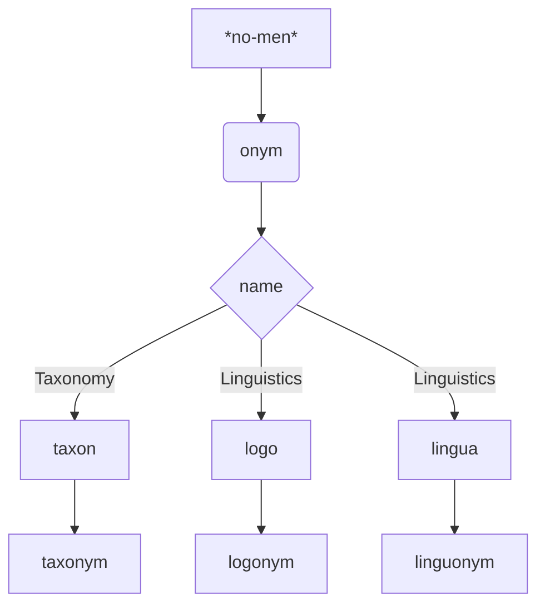

```jsx:component:MusicPlayer

const fs = require('fs');
const path = require('path');

function getAudioDataURL(filePath) {
    const audioData = fs.readFileSync(filePath);
    return 'data:audio/mpeg;base64,' + audioData.toString('base64');
}

function extractFileName(filePath) {
    return path.basename(filePath);
}

const vaultPath = app.vault.adapter.basePath;
const relativeMusicFolderPath = '40 - Obsidian/音乐';
const folderPath = path.join(vaultPath, relativeMusicFolderPath);

const audioFilePaths = fs.readdirSync(folderPath)
    .filter(file => path.extname(file) === '.mp3')
    .map(file => path.join(folderPath, file));

const audioDataUrls = audioFilePaths.map(getAudioDataURL);

const [selectedAudioIndex, setSelectedAudioIndex] = useState(0);
const audioRef = useRef(null);

function handleAudioEnd() {
    if (selectedAudioIndex < audioDataUrls.length - 1) {
        setSelectedAudioIndex(selectedAudioIndex + 1);
    } else {
        setSelectedAudioIndex(0);
    }
    audioRef.current.play();
}

// useEffect(() => { if (audioRef.current) { audioRef.current.play(); } }, [selectedAudioIndex]);

const [isFirstMount, setIsFirstMount] = useState(true);


useEffect(() => {
    setIsFirstMount(false);
}, []);

useEffect(() => {
    if (audioRef.current && !isFirstMount) {
        audioRef.current.play();
    }
}, [selectedAudioIndex]);


return (
    <div className="audio-container">
        <select className="audio-dropdown"
            value={selectedAudioIndex}
            onChange={(e) => {
                setSelectedAudioIndex(Number(e.target.value));
                setTimeout(() => audioRef.current.play(), 100);
            }}
        >
            {audioDataUrls.map((dataUrl, index) => (
                <option key={index} value={index}>
                    {extractFileName(audioFilePaths[index])}
                </option>
            ))}
        </select>
        <div className="audio-section">
            <audio ref={audioRef} controls onEnded={handleAudioEnd} src={audioDataUrls[selectedAudioIndex]} type="audio/mpeg">
                Your browser does not support the audio element.
            </audio>
        </div>
    </div>
);


```

```jsx:
<MusicPlayer></MusicPlayer>
```
```dataview  
TABLE 
FROM "A001. 字根與語言"  
```

```dataview
list
from #psychology 
```



```jsx:component:MusicPlayer

const fs = require('fs');
const path = require('path');

function getAudioDataURL(filePath) {
    const audioData = fs.readFileSync(filePath);
    return 'data:audio/mpeg;base64,' + audioData.toString('base64');
}

function extractFileName(filePath) {
    return path.basename(filePath);
}

const vaultPath = app.vault.adapter.basePath;
const relativeMusicFolderPath = '40 - Obsidian/音乐';
const folderPath = path.join(vaultPath, relativeMusicFolderPath);

const audioFilePaths = fs.readdirSync(folderPath)
    .filter(file => path.extname(file) === '.mp3')
    .map(file => path.join(folderPath, file));

const audioDataUrls = audioFilePaths.map(getAudioDataURL);

const [selectedAudioIndex, setSelectedAudioIndex] = useState(0);
const audioRef = useRef(null);

function handleAudioEnd() {
    if (selectedAudioIndex < audioDataUrls.length - 1) {
        setSelectedAudioIndex(selectedAudioIndex + 1);
    } else {
        setSelectedAudioIndex(0);
    }
    audioRef.current.play();
}

// useEffect(() => { if (audioRef.current) { audioRef.current.play(); } }, [selectedAudioIndex]);

const [isFirstMount, setIsFirstMount] = useState(true);


useEffect(() => {
    setIsFirstMount(false);
}, []);

useEffect(() => {
    if (audioRef.current && !isFirstMount) {
        audioRef.current.play();
    }
}, [selectedAudioIndex]);


return (
    <div className="audio-container">
        <select className="audio-dropdown"
            value={selectedAudioIndex}
            onChange={(e) => {
                setSelectedAudioIndex(Number(e.target.value));
                setTimeout(() => audioRef.current.play(), 100);
            }}
        >
            {audioDataUrls.map((dataUrl, index) => (
                <option key={index} value={index}>
                    {extractFileName(audioFilePaths[index])}
                </option>
            ))}
        </select>
        <div className="audio-section">
            <audio ref={audioRef} controls onEnded={handleAudioEnd} src={audioDataUrls[selectedAudioIndex]} type="audio/mpeg">
                Your browser does not support the audio element.
            </audio>
        </div>
    </div>
);


```

```jsx:component:ShowI

const files = app.vault.getMarkdownFiles();
let count = 0;
let final = "";
let cells = [];

for (var ita=0;ita<files.length;ita++){
	let today = new Date();
	let year = today.getFullYear();
	let yearString = year.toString();
	const basename = files[ita].basename;
	
	const meta = app.metadataCache.getFileCache(files[ita]).frontmatter;
	if (typeof(meta) != "undefined"){
		const birthday = app.metadataCache.getFileCache(files[ita]).frontmatter.birthday;
		if (birthday){
			let birthdaySlice = birthday.slice(4);
			let nextBirthdayString = yearString+birthdaySlice;
			let birthdayMonth = birthday.slice(5,7);
			let birthdayDay = birthday.slice(8,10);
			if (birthdayMonth.slice(0,1)==0){
				birthdayMonth = birthdayMonth.slice(1);
			} 
			if (birthdayDay.slice(0,1)==0){
				birthdayDay = birthdayDay.slice(1);
			} 
			let hanBirthday = birthdayMonth + "月" + birthdayDay + "日";
			let nextBirthdayNumber = new Date(nextBirthdayString);
			let diffBetween = Math.floor((nextBirthdayNumber-today)/3600000/24);
			let N = 0;
			diffBetween>=0? N = diffBetween:N = diffBetween+365;
			if (N < 31){
				count = count+1;
				cells.push(<div class = "birdcountdown">  <text class = "birdname"> {basename}生日还有 </text><text class="countdowndays"> {N+1}天 </text></div>) 
			}
		}
	}
}

const element = <div>未来一个月有{count}个生日: <br /> </div>;

const div3Style = {
		frameborder:"no", 
		border:"0",
		marginwidth:"0",
		marginheight:"0",
		width:330,
		height:110,
}
	  

return (
	<div class="musicBirthday">
	
		<div style= {{flex: 1, textAlign: 'center', whiteSpace: 'pre-wrap'}} >
			<p><b>MUSIC OF THE MONTH</b></p>
			<iframe  style={div3Style}  src="https://music.163.com/outchain/player?type=0&id=7354648923&auto=0&height=90"></iframe>
		</div>
		<div style= {{flex: 1, textAlign: 'center', whiteSpace: 'pre-wrap'}} >
			<p><b>UPCOMING BIRTHDAYS</b></p>
			<p>{element}{cells} </p>
		</div>
	</div>
)


```

```jsx:
<ShowI></ShowI>
```
